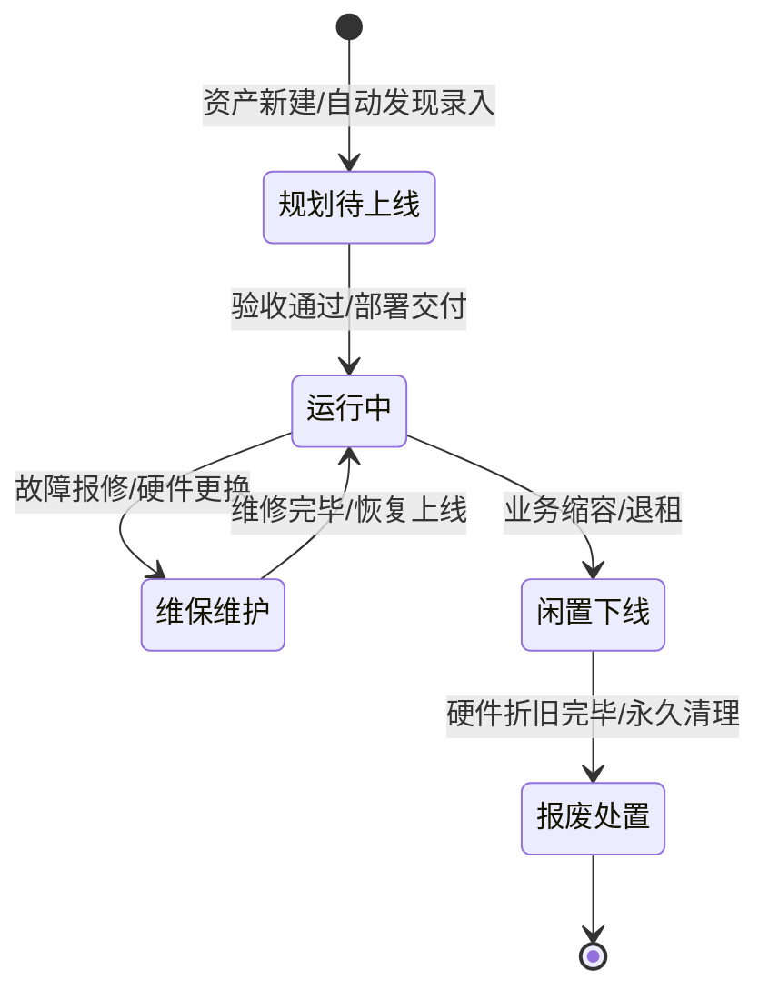
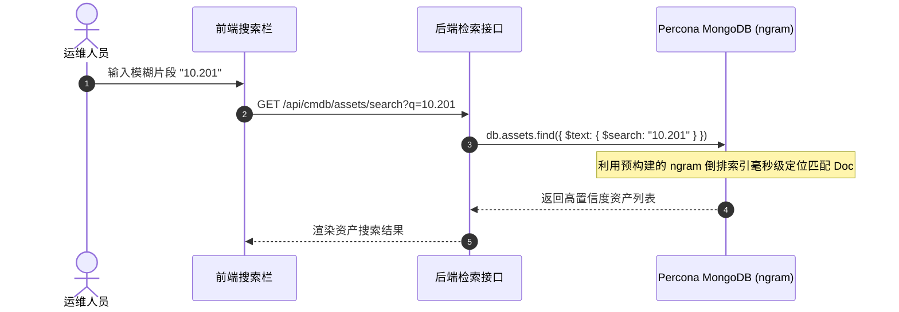

# 资产台账与全文检索

资产台账是运维日常使用频率最高的模块。ECMDB 资产台账支持海量异构 CI 资产的动态列表渲染、高级过滤组合、全生命周期跟踪，并基于 **Percona MongoDB ngram 全文检索** 技术提供极致的全局搜索体验。


## 1. 资产全生命周期管理

平台支持对每项资产从“规划采购”到“最终报废”的全链路闭环跟踪：



- **资产入库**：支持单条可视化表单录入、Excel 批量导入以及外部系统（云厂商 API、Prometheus 服务发现）通过 RESTful API 自动同步写入。
- **动态列展现**：系统根据当前选中的「资产模型」动态拉取字段配置，前端自适应渲染表格列，支持用户个性化勾选隐藏/展示列。
- **状态流转控制**：资产状态明确划分为“规划待上线、运行中、维保维护、闲置下线、报废处置”，支持通过可视化操作或 API 自动同步进行规范化流转。


## 2. 核心技术：Percona MongoDB ngram 全文检索

在日常运维排障中，工程师通常只掌握碎片化信息（例如某个不完整的内网 IP `192.168.10.x`、机器名片段 `k8s-worker`、服务端口或负责人姓名拼音）。

传统关系型数据库（如 MySQL）采用 `LIKE '%keyword%'` 会导致**全表扫描**，在大数据量下造成严重的慢查询和数据库 CPU 飙升；而通用分词引擎（如 Lucene / Elasticsearch 中文标准分词）又往往以词语为单位，无法精确匹配没有语义分隔的 IP 地址、序列号或短代码。

### 为什么选择 ngram 索引？

**ngram** 是一种基于滑窗原理的字符串切分技术。它会将任意文本按照连续的 $N$ 个字符进行切片切词，从而在不需要语言词典支持的情况下，完美命中任意子串。

```text
原始输入字符串: "192.168.1.100" (设定 3-gram)
生成切片词根集合: 
["192", "92.", "2.1", ".16", "168", "68.", "8.1", ".1.", "1.1", ".10", "100"]
```

### ECMDB 中的检索实现优势

1. **零外部组件依赖**：直接利用 **Percona Server for MongoDB** 内部原生的 Text Index ngram 扩展，无需引入庞大的 Elasticsearch 集群即可享受全文搜索能力。
2. **跨字段瞬间定位**：用户在全局搜索框输入任意字符，后台自动将查询路由至 ngram 全文索引，同时在 `hostname`、`private_ip`、`sn`、`remark` 等几十个字段中并行命中。
3. **毫秒级极速响应**：数万乃至数十万条资产明细下，检索平均延迟小于 **20ms**。




## 3. 结构化高级组合筛选

除了全局模糊搜索外，资产台账还支持基于模型元数据构建的**多维组合查询**：

- **精确匹配**：指定特定模型字段进行等值查询（如：`cloud_provider == "Aliyun"` 且 `region == "cn-hangzhou"`）。
- **范围匹配**：针对数值与时间字段支持区间查询（如：`cpu_cores >= 16`，`created_at 在近7天内`）。
- **标签过滤**：支持自定义标签（Tag）的快速多选过滤。


## 4. 变更历史与审计追溯

每一次资产的更新（无论来自管理员页面操作、Excel 批量导入还是 API 脚本同步）均会自动触发**审计快照机制**：

1. **字段级 Diff**：清晰展示哪个操作人员在何时修改了哪个字段（例如：`memory: 32GB -> 64GB`）。
2. **操作留痕**：完整记录变更人、变更时间、变更前后的字段快照与客户端 IP，实现金融级合规可查、责任到人。

> [!TIP]
> 资产不仅是孤立存在的个体，它们之间存在着紧密的上下游关系。接下来请阅读 [资产拓扑与关联关系](/cmdb/relation) 了解如何查看全维度的依赖图谱。
