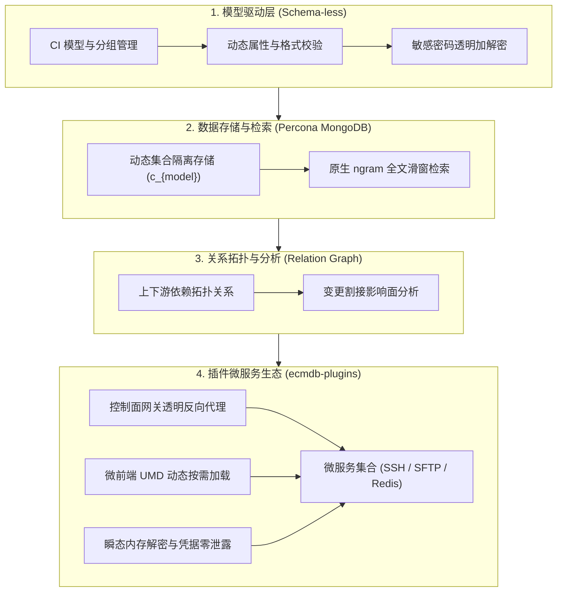

# 设计理念与架构

ECMDB 是平台中负责 **「元数据驱动」** 与 **「数字资产中枢」** 的核心微服务。它不仅支持传统物理与虚拟资源的管理，更通过**动态模型架构**与**多维关联拓扑**，提供一致、实时、高可靠的配置数据基座。

## 1. 核心定位与能力架构

在现代异构混合云与分布式环境下，资产形态涵盖物理服务器、云主机、容器集群（K8s）、网络设备及 PaaS 设施。ECMDB 打破传统 CMDB 刚性表结构的局限，围绕元数据模型驱动与运维操作入口构建能力矩阵：

## 2. 为什么采用「模型驱动架构」？

传统基于 MySQL 单表或固定列模式的资产管理系统，在面对异构资源（例如：物理机需要记录插槽和带外管理口，而云主机需要记录 VPC、可用区与安全组）时，往往需要频繁执行 `ALTER TABLE` 或通过冗余字段（如 `field_1`, `field_2`）来适配，这带来了极高的维护代价和扩展瓶颈。

ECMDB 采用 **元模型驱动设计（Metadata Model-Driven）**：
1. **模型定义一切**：每一个配置项类型（Configuration Item, CI）均是一个独立的模型，包含模型唯一标识、分类分组、显示图标以及动态属性集合。
2. **零 DDL 动态扩展**：新增资产类型或为现有资产扩容字段，无需进行数据库停机或表结构迁移，所有配置即时生效。
3. **分层抽象**：支持按业务域分类（主机、网络、存储、应用、安全），并可在此基础上建立上层服务的归属逻辑。

## 3. 存储引擎选型：为什么是 Percona MongoDB？

系统核心元数据与资产存储基于 **Percona MongoDB** 构建，充分利用了其无模式文档存储与企业级特性：

| 维度 | 传统关系型数据库方案 (MySQL / PostgreSQL) | ECMDB 方案 (Percona MongoDB) |
| :--- | :--- | :--- |
| **属性伸缩性** | 字段固定，动态字段常采用 EAV（实体-属性-值）模式，联表查询性能骤降 | 原生 BSON/JSON 文档存储，天然支持树状、嵌套与异构字段 |
| **检索效率** | 模糊查询（`LIKE '%keyword%'`）无法走常规 B-Tree 索引，全表扫描耗时高 | 内置原生 **`ngram` 全文分词索引**，毫秒级跨字段模糊检索 |
| **安全与脱敏** | 需应用层自行加密解密，字段检索困难 | 支持字段级属性加密标记，敏感凭证落库保护，安全合规 |
| **架构解耦** | 关系强绑定，数据变更影响全局关联事务 | 资产数据与 MySQL 核心权限表解耦，隔离大吞吐量高频数据读写 |

## 4. 核心特性一览

- **动态字段体系**：支持单行文本、数值、多行文本、单选/多选下拉、日期时间、引用关联以及密码加密属性。
- **高性能全文检索**：输入 IP、主机名、序列号或责任人拼音，利用 ngram 索引毫秒级定位资产。
- **多维拓扑图谱**：直观展示基础设施层级与应用服务之间的双向依赖关系。
- **微服务插件体系**：基于独立数据面微服务与微前端 UMD 热插拔技术，动态挂载 WebSSH 终端、SFTP 文件管理器与各类运维工作台，全程凭证零泄露。

> [!TIP]
> 了解了整体设计思想后，您可以继续阅读 [模型管理](/cmdb/model) 了解如何从零定制属于自己企业的 CI 资产模型。
