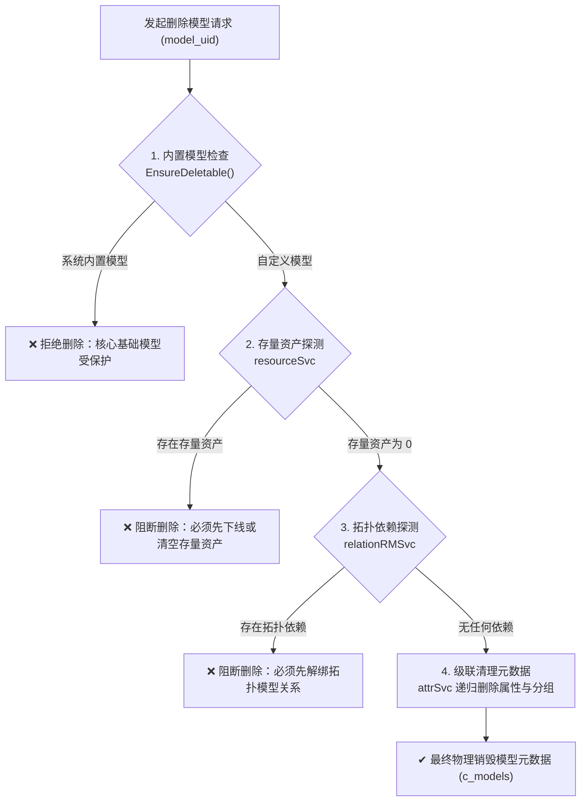

# 模型管理与字段定义

在 ECMDB 中，**模型（Model）** 是对现实基础设施与逻辑资源的元数据蓝图。用户定义模型与字段，底层自动映射为统一资产集合（`c_resources`）中的动态平铺读写，全生命周期无需触碰底层数据库 DDL。

---

## 1. 结构设计与三级编排

模型体系遵循元数据驱动设计，将分类组织、表单编排与字段存储清晰解耦：

<div class="model-step-flow">
  <div class="step-card">
    <div class="step-badge">Level 1</div>
    <div class="step-name">模型分组</div>
    <div class="step-code">Model Group</div>
    <div class="step-desc">业务分类：计算 / 网络 / 存储</div>
  </div>
  <div class="step-arrow">➔</div>
  <div class="step-card">
    <div class="step-badge">Level 2</div>
    <div class="step-name">资产模型</div>
    <div class="step-code">model_uid</div>
    <div class="step-desc">资产蓝图：host / redis / switch</div>
  </div>
  <div class="step-arrow">➔</div>
  <div class="step-card">
    <div class="step-badge">Level 3</div>
    <div class="step-name">属性分组</div>
    <div class="step-code">Attribute Group</div>
    <div class="step-desc">UI 表单编排：基础 / 规格 / 凭据</div>
  </div>
  <div class="step-arrow">➔</div>
  <div class="step-card">
    <div class="step-badge">Level 4</div>
    <div class="step-name">自定义字段</div>
    <div class="step-code">field_uid</div>
    <div class="step-desc">平铺打散入库：ip / port / password</div>
  </div>
</div>

### 核心元数据对象

* **模型标识**：全局唯一的英文标识（如 `host`、`switch`），作为资产数据模型区分、拓扑连线及 API 路由的核心锚点；
* **属性分组**：归类字段业务维度，控制控制台表单与资产详情页的渲染分区；
* **字段标识**：属性的唯一英文 Key，随资产写入直接平铺在 `c_resources` 顶层根文档中。

---

## 2. 字段类型与控制约束

系统原生提供 7 种标准字段类型，覆盖运维场景下的各类数据录入与存储需求：

| 字段类型 | 类型代码 | 适用场景与特性 | 支持控制属性 |
| :--- | :--- | :--- | :--- |
| **字符串** | `string` | 单行短文本输入（如主机名、管理 IP、序列号、MAC 地址） | 必填、敏感加密、超链接 |
| **多行文本** | `multiline` | 多行长文本输入（如备注描述、配置脚本、公钥证书、私钥） | 必填、敏感加密 |
| **数值** | `number` | 整数或浮点数字（如 CPU 核数、机柜 U 位、内存大小） | 必填 |
| **布尔** | `boolean` | 二元状态开关（是 / 否，如是否公网暴露、监控状态） | 必填 |
| **日期时间** | `datetime` | 日期与时间选择（如交付时间、保修截止日） | 必填 |
| **列表** | `list` | 预设枚举下拉选择（如云厂商、机房区域、运行状态） | 必填 |
| **文件** | `file` | 附件与文件上传（如设备巡检单、采购凭据、配置文件） | 必填 |

### 核心控制属性

* **必填校验**：开启后在前端录入、批量导入以及外部写入时执行强校验，空值直接拦截；
* **敏感加密**：仅支持字符串和多行文本，标记后自动采用 AES-GCM-256 加密落盘（存储为 `ENC:V1:...`），列表检索与详情展示自动置空脱敏；
* **超链接**：仅支持字符串，前端自动渲染为可点击跳转的外链（如云平台控制台、外部监控仪表盘）；
* **排序权重**：基于稀疏索引算法，支持在控制台通过拖拽实时重排属性的展示顺序。

---

## 3. 资产展示列设置

管理员可在模型中按需定制资产台账列表的默认展示字段与先后次序：

- **显隐与拖拽排序**：通过穿梭抽屉自由勾选显示属性，并上下拖拽调整表格列的先后顺序；
- **智能默认兜底**：新建模型若未手动配置展示列，系统默认自动提取前 6 个核心业务属性（自动排除文件类型）呈现。

---

## 4. 模型删除的四重级联安全防线

误删模型会导致关联的资产数据和网络拓扑发生不可逆破坏。ECMDB 在 Service 层实现了基于 **`IDeleteModelDependencyChecker`** 接口的多维度级联安全阻断：



### 级联依赖检查器接口

```go
// internal/service/model/model.go
type IDeleteModelDependencyChecker interface {
    // CheckBeforeDelete 深度校验模型是否可删除，若存在外部依赖则返回明确错误
    CheckBeforeDelete(ctx context.Context, modelUid string) error
}
```

<style>
.model-step-flow {
  display: flex;
  align-items: center;
  gap: 10px;
  margin: 18px 0 24px;
  flex-wrap: wrap;
}

.step-card {
  flex: 1;
  min-width: 170px;
  background: var(--vp-c-bg-soft);
  border: 1px solid var(--vp-c-divider);
  border-radius: 8px;
  padding: 12px 14px;
  transition: all 0.2s ease;
}

.step-card:hover {
  border-color: var(--vp-c-brand-1);
  transform: translateY(-2px);
  box-shadow: 0 4px 12px rgba(0, 0, 0, 0.05);
}

.step-badge {
  display: inline-block;
  font-size: 10px;
  font-weight: 700;
  color: var(--vp-c-brand-1);
  background: var(--vp-c-brand-soft);
  padding: 1px 6px;
  border-radius: 4px;
  margin-bottom: 6px;
  letter-spacing: 0.5px;
}

.step-name {
  font-size: 14px;
  font-weight: 600;
  color: var(--vp-c-text-1);
  margin-bottom: 2px;
}

.step-code {
  font-size: 11px;
  font-family: var(--vp-font-family-mono);
  color: var(--vp-c-brand-1);
  margin-bottom: 4px;
}

.step-desc {
  font-size: 11.5px;
  color: var(--vp-c-text-2);
  line-height: 1.4;
}

.step-arrow {
  font-size: 14px;
  color: var(--vp-c-text-3);
  font-weight: bold;
}

@media (max-width: 768px) {
  .step-arrow {
    display: none;
  }
}
</style>
