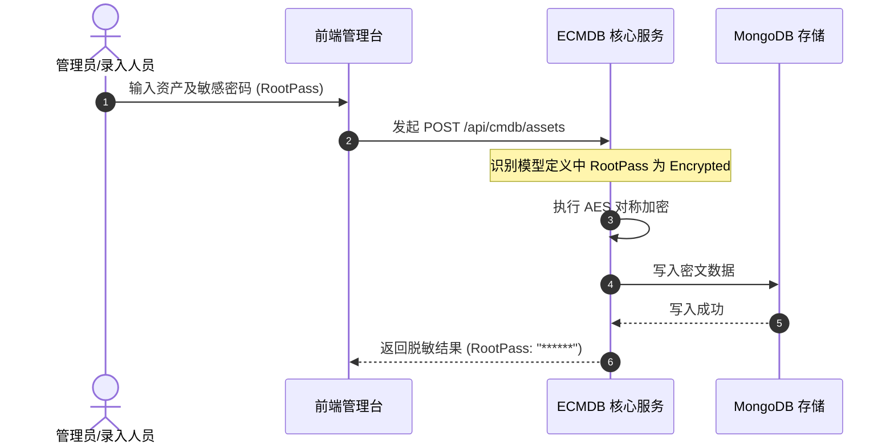

# 模型管理与字段定义

在 ECMDB 中，**模型（Model）** 是对现实基础设施与逻辑资产的抽象蓝图（类似于面向对象中的 Class）。所有的资产数据（如某台具体的云主机）都是某个模型的**实例（Instance）**。

通过模型管理，管理员可以在不修改底层数据库结构的前提下，任意定义系统所需的配置项结构。


## 1. 模型结构与层级

系统按 **「模型分组（Group）」** 与 **「具体模型（Model）」** 组织资产维度：

```mermaid
graph TD
    Root[资产模型树] --> Group1[主机与计算资源]
    Root --> Group2[网络与安全设施]
    Root --> Group3[应用与中间件]

    Group1 --> M1[物理服务器]
    Group1 --> M2[云主机 (CVM/ECS)]
    Group1 --> M3[Kubernetes 集群]

    Group2 --> M4[交换机/路由器]
    Group2 --> M5[负载均衡 (SLB)]
    Group2 --> M6[防火墙规则]

    Group3 --> M7[MySQL 数据库实例]
    Group3 --> M8[Redis 缓存集群]
```

### 模型基础元数据
创建模型时需配置以下基础属性：
- **模型唯一标识（UID）**：全系统唯一的英文字符串（如 `host`, `switch`, `k8s_cluster`），作为底层文档集合及 API 调用的依据。
- **模型名称**：直观的展示名称（如“云主机”、“交换机”）。
- **所属分组**：资产所在的逻辑大类（计算、网络、存储、业务等）。
- **模型图标**：直观的 UI 图标，在拓扑图谱及导航中展示。


## 2. 字段类型与配置规范

每个模型由若干个 **字段（Attribute）** 构成。ECMDB 提供了丰富的字段类型与校验规则：

| 字段类型 | 适用场景 | 属性说明与示例 |
| :--- | :--- | :--- |
| **单行文本 (`string`)** | 主机名、SN 号、MAC 地址、公网 IP | 支持正则表达式校验、最小/最大字符限制 |
| **多行文本 (`text`)** | 备注说明、配置片段、初始化脚本 | 支持长文本展示与换行 |
| **数值型 (`number`)** | CPU 核心数、内存容量 (GB)、机柜 U 位 | 支持最小值、最大值、步长控制 |
| **布尔开关 (`boolean`)** | 是否通外网、是否生产环境、是否纳管监控 | 展现为 Switch 开关组件 |
| **单选枚举 (`select`)** | 云厂商（阿里云/腾讯云/AWS）、运行状态 | 可配置静态选项列表（Label / Value 键值对） |
| **多选枚举 (`multi_select`)** | 关联标签、安装组件列表 | 数组形态存储，支持多选标签渲染 |
| **日期时间 (`datetime`)** | 上架时间、维保到期日、折旧周期 | 支持标准格式化（YYYY-MM-DD HH:mm:ss） |
| **密文字段 (`password`)** | SSH 登录凭证、DB 访问密码、Token | **核心安全特性**：落库对称加密，前端默认掩码展示 |
| **外键引用 (`reference`)** | 归属机房、负责人、所属业务系统 | 关联至其他模型或系统用户列表 |


## 3. 字段的高级约束与安全控制

为了保障资产录入的数据质量与合规要求，每个字段均可开启细粒度控制：

### 1. 必填约束（Required）
标记为必填的字段在前端录入、批量导入及 API 提交时均会受到严格拦截，避免关键参数遗漏。

### 2. 唯一性校验（Unique）
如序列号（SN）、管理 IP 或云实例 ID 等关键凭证，可勾选唯一索引约束，系统会在数据库层面构建唯一索引，杜绝重复资产登记。

### 3. 加密与脱敏（Encrypted & Masked）
对于敏感资产信息（如主机的初始 root 密码、BMC 控制台密码等）：
- **存储端**：系统采用 AES-GCM 算法对字段明文进行对称加密后存入 MongoDB，防止数据库备份泄露导致安全风险。
- **前端展示**：在资产详情中统一显示为星号（如 `******`），仅拥有审计/解密权限的角色点击“查看”按钮并记录审计日志后方可查看明文。
- **插件微服务联动**：[微服务插件体系](/cmdb/plugin)（如 WebSSH、SFTP、Redis 管理器）或自动化任务执行时，仅由插件后端通过内网 gRPC 申请内存瞬态解密并建立物理会话，操作人员与前端浏览器全程无需也不可能知晓真实密码。




## 4. 内置基础字段规范

为了规范资产的全生命周期流转，系统会为每个模型默认注入以下系统级元字段：

- `_id`：MongoDB 默认主键 Object ID。
- `created_at` / `updated_at`：记录创建时间与最后更新时间。
- `created_by` / `updated_by`：操作人标识。
- `status`：资产状态（在线、待上线、维保中、报废下线）。

> [!NOTE]
> 模型定义完成后，您可以进入 [资产台账与检索](/cmdb/asset) 查看如何在实际业务中录入、批量管理及高速查询资产数据。
