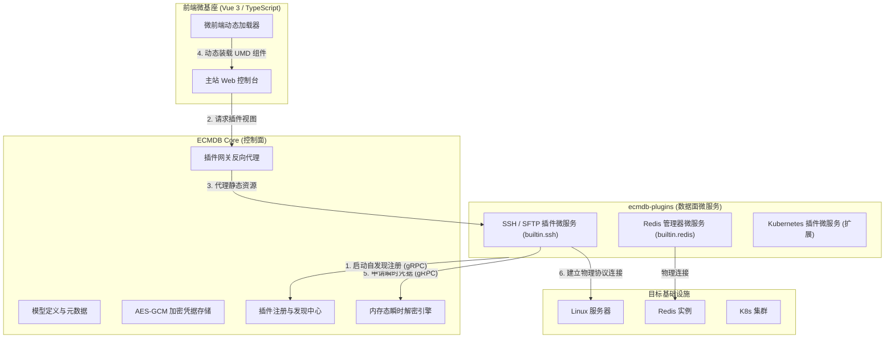
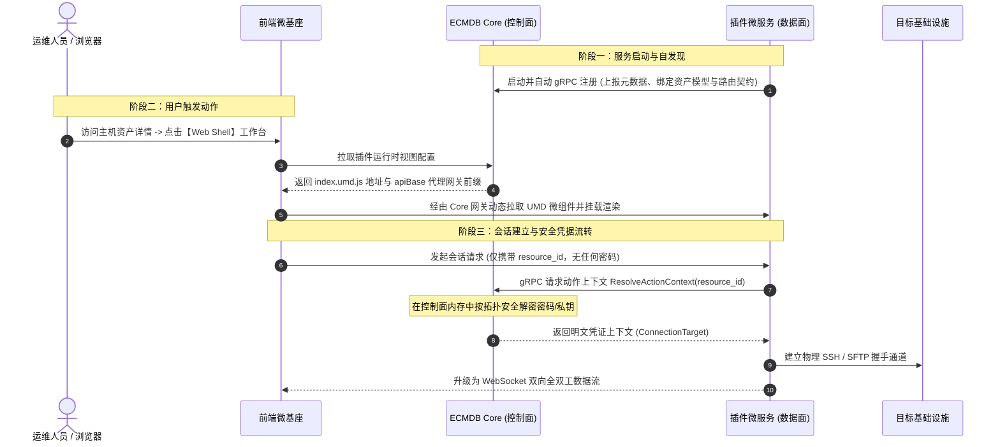
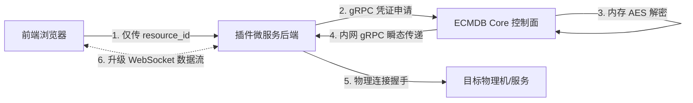

# 微服务插件体系

ECMDB 将资产元数据中心与实际运维操作面彻底解耦，构建了 **控制面 (Control Plane) 与数据面 (Data Plane) 分离** 的微服务插件体系 (`ecmdb-plugins`)。

传统 CMDB 往往仅作为静态的资产属性台账，运维人员若需进行实际操作（如登录终端、拉取配置、管理缓存），通常需要在 CMDB 与各运维工具之间来回切换；若将操作逻辑硬编码在 CMDB 内部，又会导致系统严重膨胀。ECMDB 采用插件微服务架构，使资产具备即开即用的动态运维能力。

- **源码仓库**：[GitHub: Duke1616/ecmdb-plugins](https://github.com/Duke1616/ecmdb-plugins)


## 1. 架构定位与设计原则



### 核心设计原则

1. **控制面与数据面彻底解耦**：ECMDB Core 专注元数据管理、权限校验与凭据安全；插件微服务独立承载底层连接握手与具体运维协议。
2. **热插拔与独立演进**：插件以独立微服务部署，采用 Mono-repo 体系管理，插件升级或故障不影响 ECMDB 主站稳定性。
3. **零信任凭据安全流转**：敏感凭证（SSH 密码、私钥、数据库口令）绝不下发给浏览器，全链路仅在后端微服务内存中瞬态流转，用后即弃。
4. **微前端热加载**：插件前端打包为标准 UMD 格式微组件，主站基座在运行时动态加载，插件发版无需重新编译主站。


## 2. 交互时序流转

插件微服务的运行遵循标准化的生命周期交互：




## 3. 两类插件模型与 DSL 编排

在 `ecmdb-plugins` 体系中，插件被抽象为两类业务形态：

| 插件形态 | 核心特点 | 典型场景 | DSL 编排示例 |
| :--- | :--- | :--- | :--- |
| **资产驱动型 (Target-Driven)** | **最常用**。与 CMDB 具体资产模型（或复合拓扑）强绑定，在资产详情页声明式挂载运维工作台。 | SSH 终端、SFTP 文件管理、Redis 管理器、数据库管控台 | `plugin.Target[T](reg, modelUID).Model(...).Workspace(...)` |
| **纯动作型 (Pure Actions)** | 无资产绑定。作为系统级全局入口或批量排障工具。 | 网络连通性检测、集群全局巡检 | `reg.Action("ping", "Ping").Definition()` |

### 资产驱动型插件定义示例 (Go)

```go
package define

import (
	"context"
	"github.com/Duke1616/ecmdb/pkg/plugin"
)

const (
	PluginUID     = "builtin.redis"
	ActionConsole = "console"
	ModelRedis    = "redis_instance"
)

// 1. 声明数据资产模型结构
// 包含 password/secret/token 等字段由主站底层自动识别并加密存储
type RedisTarget struct {
	Host     string `plugin:"host,label=主机地址,field=ip,required"`
	Port     int    `plugin:"port,label=连接端口,default=6379"`
	Password string `plugin:"password,label=连接密码"` // 敏感加密字段
	DB       int    `plugin:"db,label=默认库号,default=0"`
}

// 2. 导出自描述元数据契约
func (p Provider) Definition() (plugin.Definition, error) {
	reg := plugin.NewRegistry(
		PluginUID,
		"Redis 管理器",
		plugin.Type("builtin"),
		plugin.Version("1.0.0"),
		plugin.Description("提供 Redis 在线命令行交互与实时监控能力"),
		plugin.ExternalServiceRuntime(p.upstream, plugin.RuntimeHealthPath("/healthz")),
	)

	return plugin.Target[RedisTarget](reg, ModelRedis).
		Model("Redis实例", "缓存服务").
		Workspace(
			ActionConsole,
			"Redis 控制台",
			plugin.Icon("Terminal"),
			plugin.Permission("cmdb:redis:console"),
			plugin.CardFields("name", "ip", "port"),
		).
		Definition()
}

// 3. 消费动作上下文：一键向主站拉取内存态已解密凭据
func ResolveRedisTarget(ctx context.Context, resolver plugin.ContextResolver, resourceID int64) (RedisTarget, error) {
	return plugin.ResolveActionRoot[RedisTarget](ctx, resolver, PluginUID, ActionConsole, resourceID)
}
```


## 4. 全链路凭据零泄露机制

传统运维系统常因前端直接接收解密后的明文凭证，导致 DevTools 审查网络请求即可截获机密密码。ECMDB 采用零信任瞬态内存流转机制：



1. **静态高强度加密**：写入 CMDB 的所有主机密码、私钥、Token，在落盘前均通过 AES-GCM 高性能算法密文存储。
2. **前端凭据零可见**：浏览器端仅持有资产全局唯一 `resource_id`，请求包体中不包含任何敏感凭据。
3. **瞬态内存流转**：仅在底层建立物理连接的一瞬间，插件后端通过内网专用 gRPC 通道向 Core 发起凭据申请；Core 在内存中即时解密并返回，插件完成协议握手后立即在内存中释放，全链路不落盘。


## 5. 微前端热插拔机制 (UMD)

主站前端基座具备通用的微前端组件动态加载引擎，插件前端与主站实现完全解耦：

### 核心约定

- **打包格式**：插件前端统一打包为标准 UMD 单包 (`index.umd.js` + `index.css`)，由插件微服务自身直接静态托管。
- **公共依赖外部化**：`vue`、`element-plus`、`pinia` 由主站基座统一运行时注入，禁止打包进插件产物，极大缩减插件体积。
- **全局命名规范**：遵循 `EcmdbPlugin` + PascalCase 规则。例如插件 ID 为 `builtin.ssh`，挂载全局变量名为 `window.EcmdbPluginBuiltinSsh`。
- **标准入口**：入口文件统一导出 `export { Index }`，基座按需挂载。


## 6. 双层网关反向代理

插件微服务部署在内网环境中，无需对外暴露物理端口，统一由 ECMDB 控制面网关提供反向代理：


| 请求层级 | 请求路径示例 | 代理行为 |
| :--- | :--- | :--- |
| **浏览器发起** | `/api/cmdb/plugin-runtime/builtin.ssh/static/index.umd.js` | 请求微前端静态产物或业务 API |
| **Nginx 网关** | `/api/plugin-runtime/builtin.ssh/static/index.umd.js` | 剥离 `/cmdb` 业务域前缀，转发至 Core |
| **ECMDB Core** | `/static/index.umd.js` | 剥离前缀，透明转发至插件后端监听端口 |

> **开发规范**：插件微前端调用自身后端接口时，必须使用主站注入的 `props.apiBase` 作为 URL 前缀，严禁硬编码插件物理地址。


## 7. 官方插件实现参考

### 1. SSH / SFTP 插件 (`builtin.ssh`)

- **Web 终端控制台**：基于 `xterm.js` 构建，支持完整 ANSI 终端色彩、Vim/Emacs 全屏编辑、窗口自适应（Window Resize）及快捷命令代填。
- **可视化 SFTP 资源管理器**：图形化浏览远程主机目录树，支持拖拽批量上传、文件下载、权限属性查看与轻量配置文件在线即时编辑。

### 2. Redis 插件 (`builtin.redis`)

- 提供独立连接会话窗口，支持在线命令行调试、实时键值查询与连接指标监控。
- 绑定 `redis_instance` 资产模型，支持在资产详情页一键开启管理工作台。
