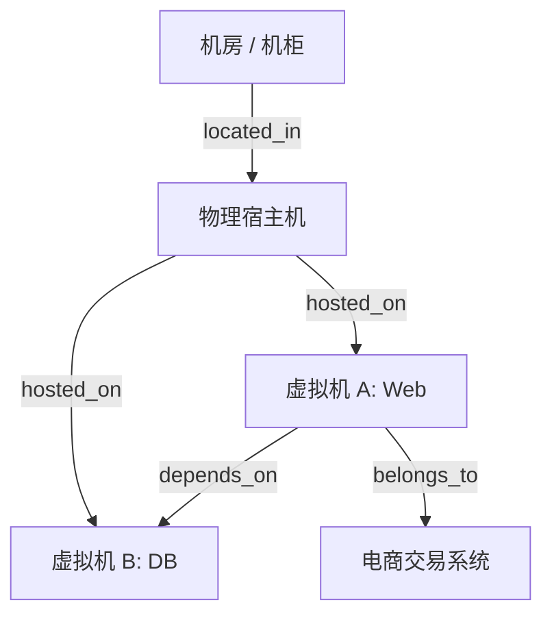
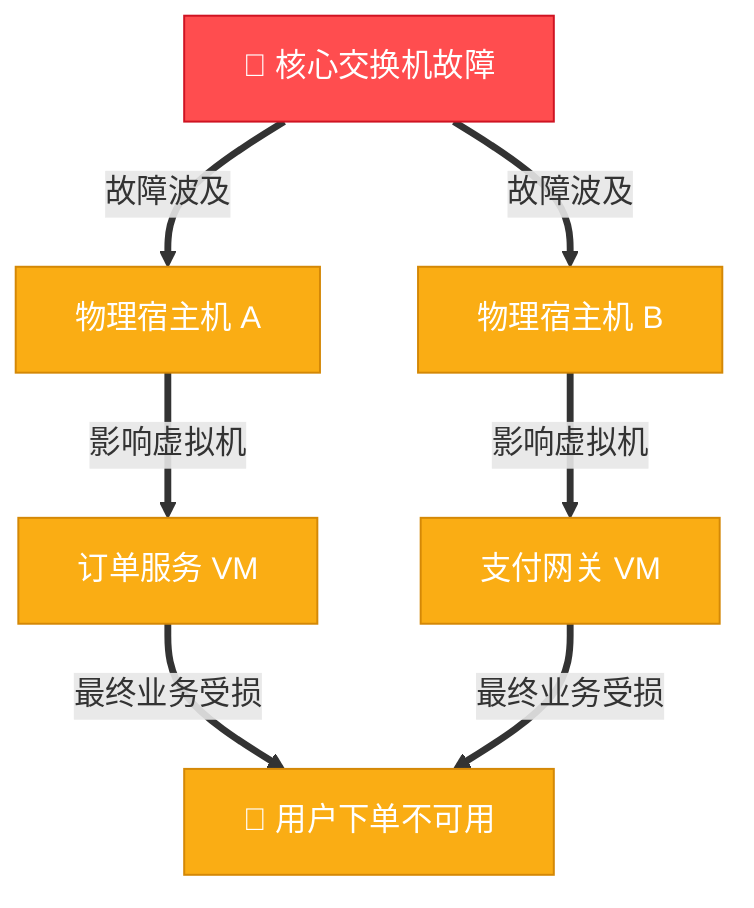

# 资产拓扑与关联关系

在企业复杂的 IT 架构中，资产并非孤立存在。一台物理交换机承载着数十台宿主机，宿主机上运行着数百个虚拟化节点，其上部署着微服务、数据库并最终服务于某个核心业务系统。

ECMDB 通过**拓扑关联引擎**将这些平铺的资产打通，构建出立体的“数字孪生”关系图谱。

## 1. 关系类型定义

系统支持自定义资产之间的**连接关系类型（Relation Type）**，支持声明有向依赖：

| 关系标识 | 关系名称 | 源模型 (Source) | 目标模型 (Target) | 语义方向说明 |
| :--- | :--- | :--- | :--- | :--- |
| `hosted_on` | 运行宿主 | 虚拟机 / 容器 | 物理宿主机 | 正向：VM 运行在 Host 上；反向：Host 承载 VM |
| `connected_to` | 网络连接 | 服务器 / 网卡 | 交换机端口 | 双向物理/逻辑互联 |
| `member_of` | 成员归属 | 节点 / Pod | K8s 集群 | 节点归属于特定集群 |
| `depends_on` | 服务依赖 | 业务前端应用 | 数据库 / 缓存集群 | 应用依赖于底层数据存储 |
| `located_in` | 物理位置 | 物理服务器 | 机房机柜 | 资产安装于指定物理空间 |

## 2. 基于 Relation-Graph 的可视化图谱

前端管理台集成了高性能的图分析组件，为用户提供可交互、高颜值的全景图谱：

1. **节点自适应布局**：支持**力导向图（Force-directed）**、**树状层级布局（Tree）**、**环形布局**等多套视图算法，自动计算节点排布，防止连线交叉混乱。
2. **多层动态下钻**：支持以当前资产为锚点，向外展开 1 层、2 层或 N 层关联节点，点击任意节点可异步加载其关联的下级节点。
3. **节点状态感知**：拓扑节点携带实时状态指示灯（绿色表示正常运行、红色表示产生告警、灰色表示已下线），一目了然掌握资产全貌。

## 3. 故障根因与影响面分析 (Blast Radius)

建立资产拓扑关系的最大业务价值在于**重大变更前的风险评估**与**故障发生时的快速止损**：

### 变更前影响面评估
当需要对某台物理交换机或核心存储进行停机割接时：
- 点击该资产的“拓扑分析”视图。
- 向上追踪所有直连宿主机、虚拟机及业务实例。
- 一键导出受影响的**上层业务名单**与**责任人列表**，作为变更割接与故障应急预案的评估依据。

### 故障根因追踪
当监控告警提示某关键业务 API 响应超时时：
- 通过图谱向下追溯其依赖的中间件、宿主机与网络链路。
- 结合实时告警状态，快速定位是否由底层宿主机 CPU 饱和或物理网卡丢包引发的级联雪崩。

## 4. 关系数据的维护方式

- **可视化连线绑定**：在资产详情页或拓扑画布中，直接通过拖拽端口连接线或下拉选择目标资产完成关系绑定。
- **批量导入与编排**：支持在 Excel 模板中定义关联列，导入时自动解析拓扑连线。
- **外部同步引擎**：通过 ETask 采集脚本或云 API 采集器，自动识别云厂商 VPC、子网与实例的包含关系并同步至拓扑库。

> [!TIP]
> 资产不仅具备静态属性与拓扑关系，还可通过 [微服务插件体系](/cmdb/plugin) 动态挂载运维工作台（如在线 WebSSH 终端、SFTP 文件管理与 Redis 控制台）。
