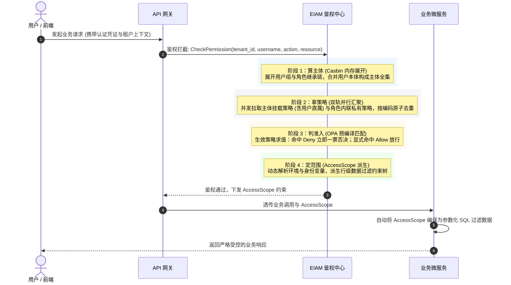

# 设计理念与架构

EIAM（Enterprise Identity and Access Management）是平台生态体系中面向微服务架构的**统一身份治理与访问控制中枢**。

系统原生支持**多租户强隔离与组织治理**，基于 **Casbin（主体层级图计算） + OPA（统一策略与数据范围裁决）** 双引擎架构构建，为全生态子系统提供集中式身份认证、细粒度功能鉴权以及基于属性的行级数据范围（PBAC / AccessScope）决策能力。

- **源码仓库**：[GitHub: Duke1616/eiam](https://github.com/Duke1616/eiam)
- **服务协议**：对外提供标准 RESTful HTTP (`:9000`) 与高性能 gRPC (`:8077`) 契约接口


## 1. 为什么采用双引擎架构？

在现代企业级权限治理体系中，权限判定实际上包含两个不同维度、关注点迥异的技术诉求：

1. **组织关系拓扑（主体图计算）**：关注用户、用户组、岗位与角色之间的层级隶属与继承关系。此类关系相对稳定、读取频次极高，需要极快的主体链展开速度与开箱即用的直观建模。
2. **业务策略逻辑（准入与数据范围）**：关注在具体的业务操作场景下，如何根据操作动作、资源标识及运行时上下文进行细粒度裁决，并生成动态的行级数据过滤约束。

面对这两个维度的诉求，行业内成熟的工具各有其最契合的设计哲学：

### 工具哲学与契合场景

- **Casbin：成熟高效的主体关系图引擎**
  - Casbin 内置完善的 PERM（Policy, Effect, Request, Matcher）模型与原生 RBAC 角色继承支持；
  - 角色继承图完全常驻内存，通过有向无环图（DAG）遍历能够在微秒级展开用户多层嵌套的身份链条，学习曲线平缓、工程维护成本极低；
  - 天然契合作为高并发下的**主体层级图计算器**。
- **OPA / Rego：表达力顶级的声明式策略引擎**
  - OPA 作为云原生计算基金会（CNCF）的通用策略引擎工业标准，采用专门面向策略设计的声明式语言 Rego；
  - 极其擅长处理声明式策略文档匹配、集合推导与细粒度条件约束，尤其适合承载类似 AWS IAM 规范的复杂 PBAC 策略裁决；
  - 天然契合作为无状态的**策略准入裁决与数据范围派生引擎**。

### EIAM 的设计思路：各展所长的协同架构

EIAM 采用双引擎融合架构，并非在两个成熟体系中做非此即彼的取舍，而是**让专业工具专注于自身最擅长的场景**，形成优势互补的鉴权流水线：

- **Casbin 专职“算主体”**：负责管理组织拓扑中的用户、岗位组与角色继承链，以纯内存图计算实现微秒级的主体关系展开；
- **OPA 专职“判准入与定范围”**：负责基于标准策略文档进行无状态的模式匹配、显式 Deny 覆盖判定，并结合请求上下文动态派生数据访问边界（AccessScope）。

两者分工协作，既保留了经典 RBAC 面对复杂组织架构时的直观易用与极致响应，又获得了现代 PBAC 面对细粒度业务资源与行级数据过滤时的强大表达力与前瞻性。


## 2. 多租户隔离底座

在企业级与 SaaS 化运营场景下，EIAM 将多租户隔离作为底座级约束，所有身份拓扑、角色与策略均在严格的租户边界内自治运转：

- **双租户上下文（身份面与数据面分离）**：
  - **身份归属租户（`origin_tenant_id`，身份平面）**：锚定用户真实的母体租户归属，会话期间不可篡改。权限判定（Casbin 展开主体、拉取生效策略）始终对齐此租户；同时作为跨租户准入防线（仅系统超管 `origin_tenant_id = 1` 允许跨租户运维，普通租户跨租户请求在网关层直接 403 阻断，杜绝越权提权）。
  - **当前执行租户（`tenant_id`，数据平面）**：控制当前请求在业务数据层面的读写隔离边界。底层由 GORMx 拦截器在 SQL 中全局自动注入 `WHERE tenant_id = ?`；当超管通过 `X-Active-Tenant-ID` 切换运维目标租户时，仅动态覆写此字段，实现以超管身份安全操作目标租户数据。
- **命名空间与策略自治**：
  - **主体图计算隔离**：Casbin 的角色继承与部门树在租户作用域内独立计算，互不干扰；
  - **策略文档自治**：各租户自主维护独立的 PBAC 策略规则与数据范围，杜绝跨租户规则污染。
- **底层强防护**：
  - 数据层拦截器若发现当前上下文缺失合法租户标识，直接抛错熔断阻断执行，从数据访问源头杜绝越权。

> [!TIP]
> 详细的多租户架构细节与空间隔离机制，请参阅 [多租户与空间治理](/eiam/tenancy)；关于树形组织（部门树、部门主管、用户组）治理机制，请参阅 [组织架构与人员治理](/eiam/organization)。


## 3. 三维授权模式：直属、内联与公共托管

传统 RBAC 系统往往受限于“凡赋权必建角色”或“策略只能全局共享”，极易在长期演进中积累技术债。EIAM 原生支持三种互为补充的策略授权形态：

| 授权形态 | 绑定宿主 | 存储与生命周期 | 核心解决的痛点 | 典型应用场景 |
| :--- | :--- | :--- | :--- | :--- |
| **用户直属策略** | 直接绑定在用户账号本体 | 关联表持久化；用户存在即生效，完全解耦角色 | **杜绝角色爆炸**<br>避免为了某个人单独新建临时角色（如“张三排障角色”） | 专家特派、临时应急排障、特权巡检。即使用户不属于任何角色和部门，直属策略依然 100% 独立生效 |
| **角色内联策略** | 嵌入在角色结构体内部 | 存储于角色的 `inline_policies` JSON 列中；随角色同生共灭 | **杜绝策略库污染**<br>避免专属于特定角色的个性化规则泛滥到租户全局策略库 | 岗位专用的高度定制化权限（如初审员仅审特定前缀工单）。对租户公共策略库完全隐形，不污染全局资产 |
| **公共托管策略** | 挂载到角色 / 组 / 用户 | 租户级公共独立资产；各主体按需引用挂载 | **提升通用策略复用度**<br>标准化的策略模板只需集中维护一份 | 常用只读包、通用审计包、标准开发包等跨团队共享复用 |

```json
// 示例：角色实体定义（公共策略引用 vs 私有内联策略嵌入）
{
  "code": "ticket_reviewer",
  "name": "工单初审员",
  "attached_policy_codes": ["common_read_policy"], // 引用公共托管策略
  "inline_policies": [                             // 角色私有内联定制策略（随角色同生灭，不污染全局策略库）
    {
      "code": "inline_scope_review",
      "effect": "Allow",
      "action": ["ticket:approve"],
      "resource": ["*"]
    }
  ]
}
```


## 4. 鉴权四阶段流水线

当用户发起任意 API 请求时，EIAM 将复杂的权限裁决拆解为流水线式的四个标准阶段，通俗讲就是回答四个连续的问题：

```text
阶段一：算主体 ➔ 我到底是谁？（展开组织与角色继承全集）
阶段二：拿策略 ➔ 我拥有什么权限？（双轨汇聚并去重生效策略集）
阶段三：判准入 ➔ 我能不能调用当前接口？（功能开关一票否决）
阶段四：定范围 ➔ 我能查看哪部分数据？（行级数据过滤下发）
```

---

### 阶段一：算主体（Casbin 图引擎）

> **目标**：算清“我是谁”。从单个用户名，秒级展开其背后所有关联的组织、部门和角色全集。

- **输入**：登录用户名（如 `zhangsan`）
- **核心处理**：
  - **DAG 内存图计算**：Casbin 在本地内存常驻继承拓扑图，以 $O(1)$ 复杂度秒级递归展开继承链；
  - **零 SQL 纯走内存**：各节点通过 `redisWatcher` 监听变更广播毫秒级刷新内存图，日常鉴权读请求全程 0 查数据库；
  - **用户本体即主体**：用户本体自身（`user:zhangsan`）始终作为一等主体纳入集合，为用户直接绑定策略奠定底座。
- **输出产物**：主体全集 `Subjects`，如 `[user:zhangsan, group:frontend-dev, role:editor, role:viewer]`。

---

### 阶段二：拿策略（双轨策略汇聚引擎）

> **目标**：算清“我拥有什么”。把主体全集关联的所有权限规则一张网打尽。

- **输入**：阶段一产出的主体全集 `Subjects`
- **核心处理**：
  - **双轨并行拉取**：路径 A 调用 `GetAttachedBySubjects` 拉取所有主体绑定的托管策略（涵盖用户直属）；路径 B 调用 `ListByIncludeCodes` 提取角色内嵌的私有内联策略；
  - **全量去重合并**：将双轨获取的所有策略全量压平，按策略唯一码（Policy Code）做原子级去重收敛。
- **输出产物**：当前请求生效的有效策略集 `Effective Policies`。

```go
// 双轨并行收集：主体挂载策略（含用户直属） + 各角色私有内联策略
policiesMap, _ := s.policySvc.GetAttachedBySubjects(ctx, subjects)
roles, _ := s.roleSvc.ListByIncludeCodes(ctx, roleCodes)
for _, r := range roles {
    inlinePolicies = append(inlinePolicies, r.InlinePolicies...)
}

// 全量策略平铺合并，按策略编码原子去重
effectivePolicies := lo.UniqBy(
    append(lo.Flatten(lo.Values(policiesMap)), inlinePolicies...),
    func(p domain.Policy) string { return p.Code },
)
```

---

### 阶段三：判准入（OPA / Rego 引擎）

> **目标**：判定“我能不能干”。针对目标接口与动作，给出一票否决或放行决策。

- **输入**：有效策略集 + 当前请求目标（Action 动作与 Resource 资源 URN）
- **核心处理**：
  - **预编译极速匹配**：内置 Rego 规则在启动时已预编译完成（`PrepareForEval`），支持通配符模式匹配；
  - **显式 Deny 一票否决**：
    - 只要命中任何一条 `Effect: "Deny"` 策略，立即阻断拦截；
    - 必须显式命中 `Effect: "Allow"` 且未被 Deny 命中方可通行；
    - 若未命中任何规则，执行默认隐式拒绝。
- **分支决策产物**：
  - **未命中或显式 Deny** ➔ 立即拦截阻断，返回 `403 Forbidden`
  - **命中 Allow 且无 Scope 约束** ➔ 常规业务放行（接口鉴权通过，直接透传执行）
  - **命中 Allow 且携带 Scope 约束** ➔ 进入阶段四派生行级数据范围

---

### 阶段四：定范围（AccessScope 引擎）

> **目标**：判定“我能看哪些数据”。把抽象的权限规则，动态翻译为业务微服务开箱即用的 SQL 过滤条件。

- **输入**：策略中的数据范围声明 + 运行时上下文环境
- **核心处理**：
  - **动态变量即时解析**：将声明中的动态占位符（如 `ref(username)`）替换为运行时真实值；
  - **派生行级谓词树**：自动生成结构化的行级过滤约束树（AccessScope）。
- **落地效果**：
  - 业务微服务通过底层 AST 编译器，自动将 AccessScope 转化为参数化 SQL（如 `WHERE create_by = ?`）；
  - 真正实现功能放行与行级数据安全过滤的完全解耦。


## 5. 鉴权全链路调用时序

全生态子系统向 EIAM 发起鉴权时的时序流转：




## 6. 核心工程设计对比总结

| 阶段目标 | 核心组件 | 核心输入 | 处理职责 |
| :--- | :--- | :--- | :--- |
| **算主体** | Casbin | 用户标识 `username` | 内存 DAG 展开多层用户组与角色继承链 |
| **拿策略** | Policy Engine | 主体全集 `Subjects` | 聚合直属策略、组策略、角色托管策略与内联私有策略 |
| **判准入** | OPA (Rego) | 生效策略集 + 请求目标 | 预编译模式匹配，支持通配符与显式 Deny 一票否决 |
| **定范围** | AccessScope | 数据范围声明 + 运行时上下文 | 派生行级数据约束树，下发业务微服务编译为 SQL 过滤 |

> [!TIP]
> 掌握了鉴权双引擎的流转分工后，若需深入了解类 AWS IAM 风格的策略语法定义以及行级数据过滤的操作符规范，请继续阅读 [鉴权与数据范围](/eiam/pbac)。
