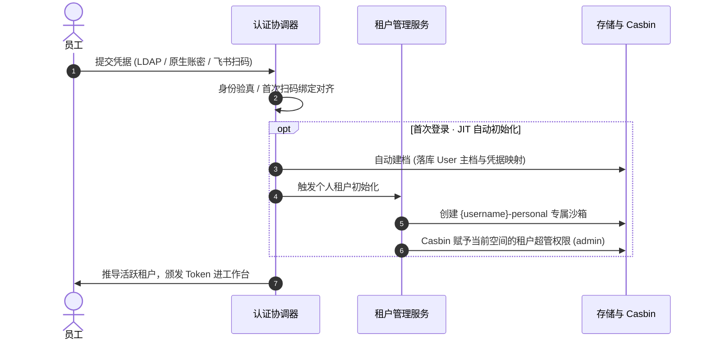

# 身份认证与多源凭据

EIAM 以全局唯一的 `username` 作为数字身份锚点，将凭据体系划分为两层模型：以 **企业 LDAP** 与 **系统原生账密** 为**主认证源**，以 **飞书扫码** 与 **Passkey** 为**快捷免密通道**。

---

## 1. 认证矩阵与凭据策略

| 凭据类型 | 架构定位 | 首次登录行为 | 日常登录体验 | MFA 策略 |
| :--- | :--- | :--- | :--- | :--- |
| **企业目录 (LDAP / AD)** | **主认证源** | 输入域账号密码，**自动建档录入** | 实时校验域控密码 | **需要** |
| **系统原生账号密码** | **主认证源** | 管理员开通或注册，**开箱即用** | 本地 bcrypt 密码比对 | **需要** |
| **飞书企业扫码** | **快捷免密通道** | 扫码后**验证一次 LDAP/账密完成绑定** | **一键扫码秒级直通** | **免 MFA** |
| **Passkey 生物免密** | **硬件凭据通道** | 在已有主账号下录入本地硬件公钥 | **Touch ID / 面容直通** | **免 MFA** |

---

## 2. 核心架构：唯一 `username` 锚点

全平台无论从哪个渠道完成验真，最终必须收敛至全局唯一的 `username`：

- **权限与审计唯一归宿**：Casbin 权限策略计算、租户成员归属以及所有审计操作流水，均强绑定于唯一的 `username`；
- **两大主认证源（确立档案）**：
  - **企业 LDAP**：直连域控（Direct Bind）实时验真，密码不落本地。员工首次登录系统自动在本地建档，无需管理员预先批量导入；
  - **原生账密**：采用标准 bcrypt 加盐哈希存储，管理员直接在后台开通或由用户注册，开箱即用。
- **第三方快捷凭据（对齐绑定）**：
  - 飞书等第三方平台仅返回外部标识（`open_id` / `user_id`），无法确定其在企业内的身份；
  - **首次扫码**：提示输入一次现有的 **LDAP 账号** 或 **原生账密**，完成身份对齐与绑定映射；
  - **后续登录**：直接读取绑定的凭据映射，一键秒级直通，免输密码且免 MFA。

---

## 3. JIT 即时预供与个人沙箱

EIAM 采用 JIT（Just-In-Time）机制，新员工首次登录无需等待管理员手动开号与分配空间：

### JIT 核心保障
1. **自动建档**：LDAP 首次登录无感落库主档，飞书绑定后自动沉淀凭据关联；
2. **即时沙箱**：新用户自动获得独立的个人租户空间，并享有本空间的**租户超级管理员 (`admin`)** 权限，放手体验不扰生产；
3. **即时冻结**：员工离职域账号在 LDAP 被停用后，实时 Direct Bind 立即被拒，杜绝幽灵账号。

---

## 4. 差异化 MFA 决策

针对不同凭据的物理安全级别，系统实施差异化二次认证：

- **免 MFA（强物理硬件凭据）**：
  - **Passkey**：私钥安全保存在本地芯片（Secure Enclave），由生物识别硬件验签，抗钓鱼且天然具备双因子属性；
  - **飞书扫码**：移动端 App 已在受控设备上通过生物或锁屏认证，扫码属于物理交互，天然免 MFA。
- **需 MFA（知识型单因子密码）**：
  - **LDAP / 原生账密**：传统密码容易受到弱口令或撞库威胁，开启 MFA 策略后必须输入 6 位 TOTP 动态口令。

---

> [!TIP]
> 完成身份认证并进入租户空间后，若需了解系统如何对外提供 OIDC / CAS / SAML 单点登录服务，请继续阅读 [统一 IDP 与单点登录](/eiam/idp)。
