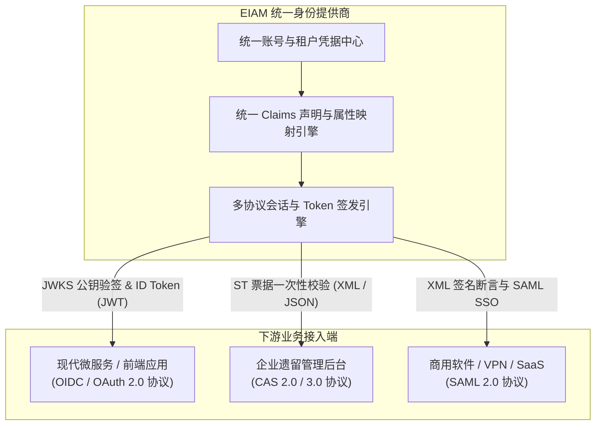
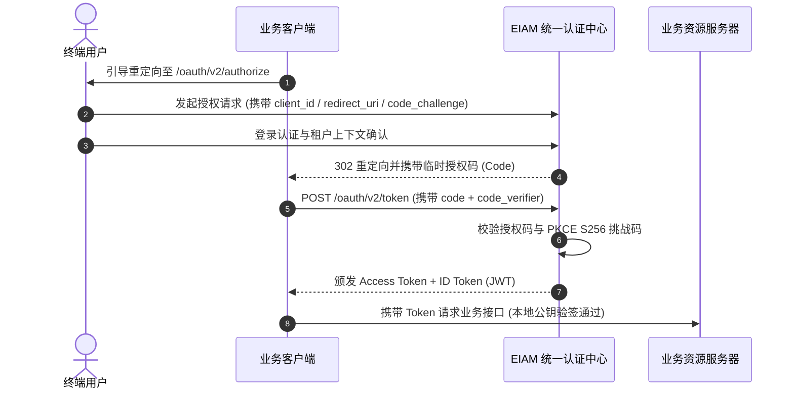

# 统一 IDP 与单点登录

EIAM 作为企业统一身份提供商（IdP），基于统一账号底座对外提供 **OIDC / OAuth 2.0、CAS 2.0/3.0 与 SAML 2.0** 三大主流协议输出，实现全业务矩阵“一次登录，处处通行”。

---

## 1. 多协议输出矩阵



| 协议标准 | 服务端角色 | 核心端点 | 典型接入场景 |
| :--- | :--- | :--- | :--- |
| **OIDC / OAuth 2.0** | **OpenID Provider (OP)** | `/.well-known/openid-configuration`<br>`/oauth/v2/authorize`<br>`/oauth/v2/token`<br>`/oauth/v2/jwks` | 现代微服务、自研前端 SPA、移动端应用，支持标准授权码模式与 PKCE 防护 |
| **CAS 2.0 / 3.0** | **CAS Server** | `/cas/login`<br>`/cas/serviceValidate`<br>`/cas/p3/serviceValidate`<br>`/cas/logout` | 纳管企业历史遗留系统，下游系统无需重构代码，仅需配置 CAS 地址即可纳管 |
| **SAML 2.0** | **Identity Provider (IdP)** | `/saml/metadata`<br>`/saml/sso`<br>`/saml/certificate` | 对接第三方商用软件、SaaS 平台或硬件网络设备（如堡垒机、VPN 网关） |

---

## 2. 应用纳管与安全控制

下游系统在接入前需在控制台注册为接入应用（Application），提供细粒度的接入控制：

### 2.1 租户多级隔离与共享
- **系统全局共享应用（`tenant_id = 1`）**：归属于系统根租户（`system`），通过 `eiam:"shared"` 标签向全平台租户开放，全体企业成员均可登录；
- **租户私有专属应用（`tenant_id > 1`）**：由具体业务租户管理员创建，仅限本租户内成员登录，实现数据天然隔离。

### 2.2 客户端类型与防凭据泄露
- **机密客户端**：适用于具备独立后端服务的系统，系统自动生成 ClientSecret，服务端采用 **bcrypt 加盐哈希**持久化，防止数据库泄露；
- **公共客户端**：纯前端单页应用或移动端，无法安全保管密钥，系统**强制启用 PKCE（S256）挑战码校验**，杜绝授权码拦截攻击。

### 2.3 严苛的回调地址防钓鱼
严格遵循 RFC 6749 规范校验回调白名单（Redirect URIs），根治开放重定向漏洞：
- **精确比对**：OIDC 采用绝对路径比对；CAS 严格校验 Scheme、Host 与路径前缀；
- **禁止 Fragment**：回调地址中严禁携带 `#` 锚点标识；
- **开发环境友好**：本地联调环境支持对 `localhost` 与 `127.0.0.1` 动态端口的智能匹配。

---

## 3. 统一身份声明与主键防冲突

不同协议的用户属性统一抽象为标准的领域声明模型（Claims）：

```go
type Claims struct {
    Subject  string   `json:"sub"`       // 用户唯一系统 ID
    Username string   `json:"username"`  // 全局唯一登录用户名
    Name     string   `json:"name"`      // 昵称或显示姓名
    Email    string   `json:"email"`     // 电子邮箱
    Phone    string   `json:"phone"`     // 手机号码
    JobTitle string   `json:"title"`     // 职务头衔
    TenantID int64    `json:"tenant_id"` // 当前活跃租户 ID
    Roles    []string `json:"roles"`     // 用户所属角色列表
}
```

> [!IMPORTANT]
> **下游系统主键防冲突设计**：在输出 CAS 属性字典时，系统**严禁输出名为 `id` 的字段**（统一使用 `sub` 与 `uid`）。下游系统（如 Django、Rails 或自研框架）内部往往以 `id` 作为主键；若强行下发整型 `id`，极易与下游系统的 UUID 主键类型冲突导致业务崩溃。EIAM 在协议层天然规避了此类隐患。

---

## 4. OIDC / OAuth 2.0 协议实现

### 4.1 自动发现与公钥分发
- **元数据自动发现**：对外暴露 `/.well-known/openid-configuration`，下游系统配置 Issuer 即可自动拉取支持的端点与公钥；
- **RSA 2048 异步验签**：公钥集合暴露于 `/oauth/v2/jwks`，下游系统在本地直接使用公钥完成 JWT 离线验签，无需频繁远程回调鉴权，极大释放中心压力。

### 4.2 授权码模式与 PKCE 时序



---

## 5. CAS 2.0 / 3.0 协议实现

面向大量依赖 CAS 协议的企业遗留系统，EIAM 提供完备的兼容支持：

- **票据消费即失效**：用户登入后签发临时服务票据（ST），下游后端向 `/cas/serviceValidate` 验票后，Redis 中存储的票据**立即被销毁**，任何二次请求均被阻断，彻底杜绝重放攻击；
- **XML / JSON 双格式**：返回符合 Yale CAS 命名空间标准的 XML，同时支持 `/cas/p3/serviceValidate` 返回结构化 JSON；
- **CAS 1.0 基础兼容**：兼容 `/cas/validate` 返回简单的 `yes\nusername` 纯文本响应，满足老旧系统开箱即用。

---

## 6. SAML 2.0 联合身份断言

针对商用采购系统、企业级 VPN 网关与外部 SaaS 平台，提供标准 SAML 2.0 接入：

- **元数据交换**：对外输出标准 XML 格式的 `/saml/metadata`，包含 EntityID、支持的 HTTP 绑定及 X.509 签名证书；
- **双向发起模式**：同时支持服务提供商发起（SP-Initiated SSO `/saml/sso`）与身份提供商发起（IdP-Initiated SSO `/saml/login/:id`）；
- **证书在线轮换**：提供标准端点，支持在不停机的前提下平滑轮换 SAML 签名证书，保障长期运行的安全密钥轮替。

---

> [!TIP]
> 掌握统一 IDP 的多协议赋能后，若需深入了解空间隔离模型与底层安全拦截，请继续阅读 [多租户与空间治理](/eiam/tenancy)。
