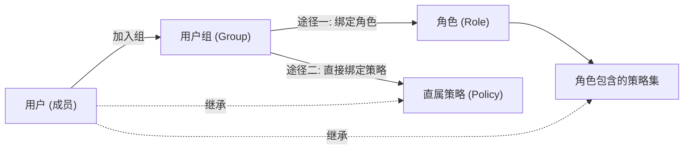
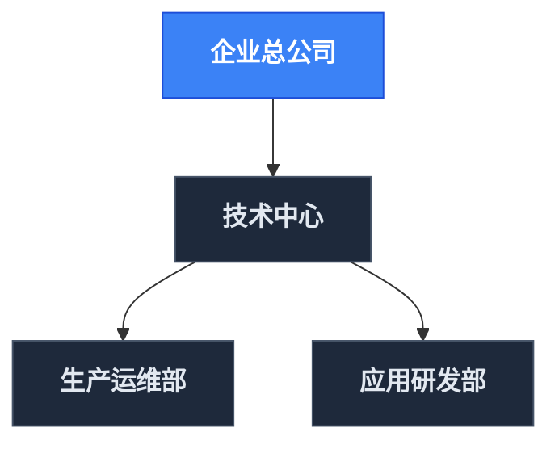

# 组织架构与人员治理

EIAM 的人员与组织管理主要聚焦于两大核心能力：**基于部门树的层级与主管动态解析**，以及**基于用户组的集中赋权与权限即时收敛**。

---

## 1. 用户组与集中赋权体系

在实际管理中，直接给个人逐一赋权会导致权限极度分散、排查困难且人员离岗时极易残留特权。

EIAM 推行**以用户组为核心的集中授权**机制。用户组（Group）作为权限载体，向下聚合用户，向上支持两种赋权途径：

### 1.1 两种赋权途径

| 赋权途径 | 机制说明 | 适用场景 |
| :--- | :--- | :--- |
| **途径一：组绑定角色** | 将一个或多个角色分配给用户组，组内所有成员自动继承该角色所打包的全部策略规则。 | **通用岗位授权**。例如给“应用运维组”绑定“资产运维角色”与“发布管控角色”，统一赋予岗位职责所需的一揽子权限。 |
| **途径二：组直接绑定策略** | 跳过角色定义，直接将特定的细粒度策略挂载到用户组上。 | **特定/临时权限按需直赋**。例如某个项目组需要临时访问特定 CMDB 模型或外部集成接口，无需专门建新角色，直接将对应策略挂在组上即可。 |

### 1.2 进组生效与即时收敛

用户组鉴权由底层 Casbin 引擎实时展开求值：
- **加入即生效**：用户加入用户组后，秒级自动继承该组绑定的所有角色与直属策略；
- **离组即清零**：人员转岗、离职或项目结项时，管理员只需将其移出用户组，相关权限立即彻底收回，**零历史残留**。

---

## 2. 部门架构与主管动态解析

部门树主要解决企业的行政层级归属，以及为外部业务流（如工单审批）提供动态的主管查找依据。

### 2.1 树形部门模型
- **层级自引用**：通过 `id`、`parent_id`、`sort` 维护多级树形结构，支持总公司、分公司、部门与小组的递归层级；
- **主部门归属**：每个员工拥有唯一的主归属部门，作为人事关系与审批汇报链的基础依据。

### 2.2 部门主管动态求值
每个部门明确区分两类负责人配置：
- **主负责人 (`main_leader`)**：部门最高决策与审批人；
- **协管人 (`leaders`)**：副职或分管协办人，支持多人互备。

#### 业务协同价值：免硬编码审批人
外部系统（如低代码工单系统 EFlow）在编排审批流时，无需在流程模板中写死具体的工号或人员：
1. 工单节点直接配置审批规则为 **“申请人直属主管”**；
2. 运行时工单系统按需调用 EIAM 查询当前申请人部门的主管；
3. 人员晋升、轮岗调动时，只需在 EIAM 调整一次部门负责人，所有业务流程自动适配生效。

---

> [!TIP]
> 了解了用户组授权与部门结构后，若需了解策略本身的结构语法（Action、Resource、Effect）与行级数据范围控制，请继续阅读 [PBAC 细粒度权限控制](/eiam/pbac)。
