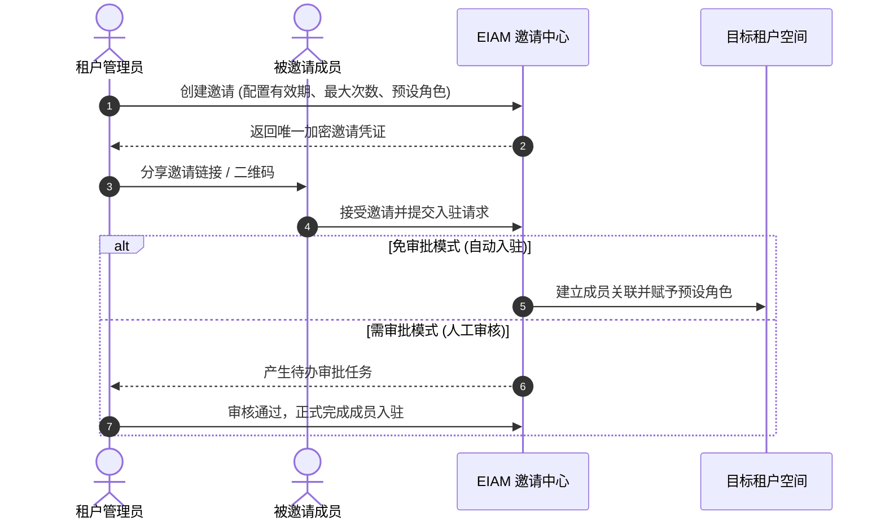

# 多租户架构与空间治理

EIAM 采用“共享数据库、按租户逻辑分片、安全插件强制拦截”的多租户架构，核心聚焦于两大技术目标：**数据底层强隔离**与**跨租户安全协同**。


---

## 1. 三级租户矩阵

EIAM 在模型上将租户划分为三层，满足全局治理、个人体验与企业生产的不同诉求：

| 租户类型 | 标识规范 | 空间定位 | 核心特权与权限模型 |
| :--- | :--- | :--- | :--- |
| **系统根租户** | `tenant_id = 1`<br>（代码标识 `system`） | 系统的母体空间与全局中枢 | 拥有最高运维治理视角，负责管理系统公共应用与全域共享资源 |
| **个人独立空间** | `tenant_id > 1`<br>（代码标识 `{username}-personal`） | 新用户首次登录时自动初始化的专属沙箱 | **当前独立空间的超级管理员 (`admin`)**，空间内完全自治，放手体验不扰生产 |
| **企业组织租户** | `tenant_id > 1`<br>（如 `infra-core`、`sec-ops`） | 各部门、业务线协作的生产资源池 | 严格遵循细粒度权限策略与行级数据范围约束 |

---

## 2. 双租户上下文机制

系统在用户认证握手与全链路请求中注入两个关键租户字段，实现**身份鉴权**与**数据过滤**的解耦：

- **身份归属租户 (`origin_tenant_id` · 身份平面)**：
  - 锚定当前账号真实的母体归属，**全链路不可篡改**；
  - 权限策略判定始终以此身份展开，作为跨租户准入底线：普通租户严禁越权调用，仅系统根租户超管在特权巡检时具备跨空间准入凭证。
- **数据操作租户 (`tenant_id` · 数据平面)**：
  - 控制当前业务数据 CRUD 的过滤边界，由底层数据插件自动注入 SQL 过滤条件；
  - 管理员在控制台切换至不同工作空间时，仅动态改变此操作目标，实现“身份不变，安全操作目标空间数据”。

> [!NOTE]
> **工作空间秒级切换**：切换工作空间时，服务端即刻销毁旧会话并重签新凭证，杜绝令牌重放；同时持久化记录用户最近活跃租户，下次登录直接还原上次工作面板。

---

## 3. GORMx 零信任底层强隔离

为防止业务开发因疏漏遗漏 `WHERE tenant_id = ?`，EIAM 在底层封装了多租户插件（`pkg/gormx/tenant_plugin.go`），全生命周期接管数据库交互：

### 3.1 生命周期回调接管
插件在 GORM 初始化阶段注册四组核心回调钩子，在 SQL 构建与执行前自动织入安全边界：

```go
func (p *TenantPlugin) Initialize(db *gorm.DB) error {
    cb := db.Callback()
    // 注册前置钩子：写屏障自动注入、读屏障安全过滤、更新/删除防跨租户越权
    _ = cb.Create().Before("gorm:create").Register("tenant:handle_create", p.handleCreate)
    _ = cb.Query().Before("gorm:query").Register("tenant:handle_query", p.handleQuery)
    _ = cb.Update().Before("gorm:update").Register("tenant:handle_update", p.handleStrict)
    _ = cb.Delete().Before("gorm:delete").Register("tenant:handle_delete", p.handleStrict)
    return nil
}
```

### 3.2 读拦截与共享模型重写 (Fail-Closed)
读取数据时，若包含租户列但上下文中缺失合法租户，插件直接报错熔断（Fail-Closed）；同时支持通过 `eiam:"shared"` 标签自动合并全局公共数据：

```go
func (p *TenantPlugin) handleQuery(db *gorm.DB) {
    if p.shouldSkip(db) || !p.hasTenantColumn(db) {
        return
    }

    tid := ctxutil.GetTenantID(db.Statement.Context)
    // 零信任熔断：若包含 tenant_id 字段但上下文缺失合法租户，直接报错拒绝执行
    if tid <= 0 {
        _ = db.AddError(errors.New("多租户安全拦截：未显式声明 IgnoreTenant 且缺失有效租户上下文"))
        return
    }

    conf := p.getSharedConfig(db.Statement.Schema)
    // 1. 共享模型 (eiam:"shared")：自动重写 SQL 合并系统根租户 (ID: 1) 的全局公共数据
    if conf.IsShared {
        p.injectQueryPolicy(db, tid.Int64(), conf) // 注入: WHERE tenant_id = ? OR tenant_id = 1
        return
    }

    // 2. 常规私有模型：强制严格隔离
    db.Where("tenant_id = ?", tid.Int64())
}
```

### 3.3 写拦截自动注入
创建实体时，插件通过反射自动提取上下文中的当前 `tenant_id` 并设入模型字段，上层业务层代码完全无感知，彻底杜绝漏写：

```go
func (p *TenantPlugin) setTenantField(ctx context.Context, field *schema.Field, value reflect.Value, tid int64) {
    // 仅在租户字段为零值时自动注入当前上下文租户，既保证安全又不破坏离线迁移时的显式指定
    if _, isZero := field.ValueOf(ctx, value); isZero {
        _ = field.Set(ctx, value, tid)
    }
}
```

---

## 4. 租户成员入驻双轨机制

EIAM 解耦了**全局账号 (`User`)** 与 **租户成员契约 (`Membership`)**。同一个账号在不同租户内的成员状态和权限互相独立。

根据管理特权层级，成员入驻设计了两种互补途径：

| 机制 | 操作主体 | 流转链路 | 典型场景 |
| :--- | :--- | :--- | :--- |
| **系统管理员直接划拨** | **系统根租户管理员** | 在后台直接选择平台已有用户，批量划归至目标租户，免受邀人确认。 | 企业统一建号、系统初始化、组织批量划拨 |
| **租户间安全邀约** | **普通企业租户管理员** | 生成加密邀请码/链接，受邀人主动接受申请，经免审或审批后入驻。 | 跨团队项目协同、外部伙伴加入、团队自主吸纳新成员 |

### 4.1 租户间安全邀约闭环

租户之间互为不可信边界。普通租户管理员**无权窥探全局花名册**，绝不能任意将外部人员强行拉入自己的空间，必须遵循邀约流转：



- **全生命周期管控**：支持配置最大使用次数与失效时间，超时或达上限自动失效；
- **预设角色注入**：创建邀请时可预先绑定角色，成员成功加入后即刻生效对应权限；
- **主动撤回与联动失效**：管理员可随时手动撤回邀请码，未处理的关联申请自动批量失效。

---

> [!TIP]
> 了解多租户隔离与工作空间治理后，若需了解企业多层级部门架构与用户组赋权体系，请继续阅读 [组织架构与人员治理](/eiam/organization)。
