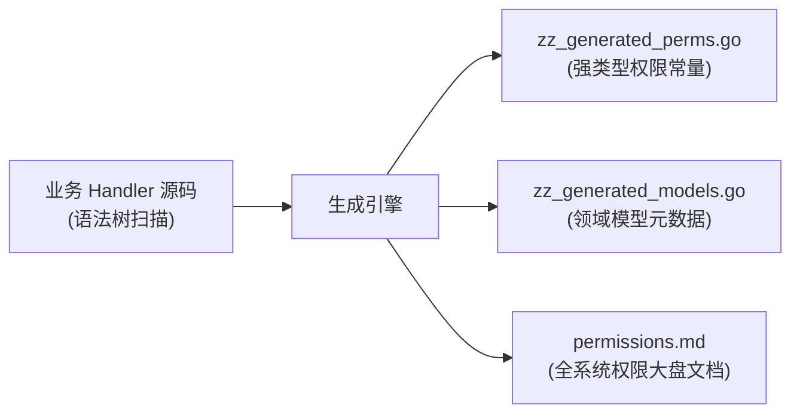

# 契约治理工具链

在微服务矩阵与跨团队协同下，接口鉴权常面临两大痛点：**权限码硬编码拼写漂移**与**接口文档维护滞后**。

EIAM 提供了一套覆盖编译期代码生成与运维凭据治理的命令行工具。所有工具均为**独立解耦、按需选用**，下游微服务可根据自身需求自由选择引入，无强制绑定。

---

## 1. 工具矩阵总览

| 工具 / 命令 | 架构定位 | 核心输入 | 核心产出 | 选用建议 |
| :--- | :--- | :--- | :--- | :--- |
| **`permgen`** | 编译期静态脚手架 | Handler 源码 | 强类型权限常量、领域模型元数据、权限蓝图文档 | 需要强类型权限拦截、杜绝字面量拼写错误时选用 |
| **`swaggergen`** | 编译期文档生成器 | Handler 结构体 | 标准接口规范 (`swagger.json`) 与离线交互网页 | 需要免手写注释快速导出 API 文档与在线调试页面时选用 |
| **`eiam token gen`** | 运维凭据生成器 | 微服务服务标识 | 资产自发现专属令牌 (`eiam_sct_*`) | 微服务需要向上自动上报并对账物理接口资产时选用 |
| **`eiam cert gen`** | 证书签发工具 | 组织名称与有效期 | 自签名证书 (`.crt`) 与私钥 (`.key`) | 离线部署、K8s Secret 挂载或单点登录证书轮换时选用 |

---

## 2. 强类型权限契约生成器

该工具基于抽象语法树静态分析业务 Handler 的路由动作与权限需求，**无需启动服务**即可完成代码与文档生成：



### 2.1 三大核心产物
1. **强类型权限常量 (`pkg/contract/permission/zz_generated_perms.go`)**：
   下游业务编写代码时，强制引用强类型常量（如 `permission.Ticket.History`）。拼写错误将在编译期被直接拦截，彻底杜绝字符串漂移；
2. **领域模型元数据 (`pkg/contract/model/zz_generated_models.go`)**：
   静态导出业务实体类型元数据，供策略引擎统一注册；
3. **权限大盘蓝图文档 (`docs/permissions.md`)**：
   自动提取模块、资源、动作的层级依赖关系，生成全平台对齐的权限字典文档。

### 2.2 命令参数
```bash
permgen \
  -s ./internal/web \
  -g ./pkg/contract/permission/zz_generated_perms.go \
  -m ./pkg/contract/model/zz_generated_models.go \
  -d ./docs/permissions.md \
  --strict
```

- `-s, --scan`：扫描的源码根目录（默认 `./internal/web`）；
- `-g, --go-out`：权限常量代码输出路径；
- `-m, --model-out`：领域模型代码输出路径；
- `-d, --doc-out`：权限大盘文档输出路径；
- `--strict`：严格模式，遇到依赖死锁或未定义时阻断退出。

---

## 3. 零注释文档生成器

传统文档工具需在 Handler 代码上手写海量注释，侵入业务且极易与真实参数脱节。

该工具通过纯静态语法分析直接提取入参/出参结构体与路由定义，实现**零注释侵入**：

### 3.1 核心产出
- **标准接口规范 (`swagger.json`)**：标准元数据，供前端自动生成代码或导入网关；
- **单文件离线交互页面 (`index.html`)**：内嵌三栏式交互前端，无需部署外部服务，本地双击即可在线调试与验签。

### 3.2 命令参数
```bash
swaggergen \
  -s ./internal/web \
  -o ./api/docs/swagger.json \
  --html ./api/docs/index.html \
  --title "EIAM API Documentation" \
  --version "1.0.0"
```

---

## 4. 微服务自发现凭据工具

在网状协同架构中，各微服务可按需向上自报自身的物理接口资产。为防止微服务之间越权篡改，提供了专属凭据签发工具：

```bash
# 为指定微服务生成资产自发现专属令牌
eiam token gen --service eflow
```

- **安全边界**：生成带有 `eiam_sct_` 前缀的高随机令牌，强绑定至系统租户与指定服务；
- **防跨服务篡改**：微服务仅被允许上报并对账其自身的路由与权限资产，无权影响其他服务；
- **配置接入**：将生成的令牌配置到微服务的配置文件中（`policy.discovery_token`），按需开启自动注册。

---

## 5. 离线证书生成工具

用于离线部署、容器挂载或单点登录证书轮换：

```bash
# 离线生成 3 年有效期的自签名证书与私钥
eiam cert gen --cn "eiam.local" --org "FleetOps" --days 1095 --out ./certs
```

- 生成标准的 `.crt` 证书与 `.key` 私钥（默认 2048 位）；
- 可直接用于签名断言与服务间双向认证。

---

## 6. 工程自动化集成

按需在项目的构建脚本中固化需要的代码生成任务：

```yaml
tasks:
  gen:perm:
    desc: 运行权限扫描并生成强类型契约与权限蓝图
    cmds:
      - go run ./cmd/permgen

  gen:swagger:
    desc: 运行零注释接口规范与交互页面生成
    cmds:
      - go run ./cmd/swaggergen
```

---

> [!TIP]
> 掌握了鉴权、多租户、单点登录与工具链体系后，若需了解系统在生产环境的落地，请参阅 [生产部署与高可用指南](/system/deploy)。
