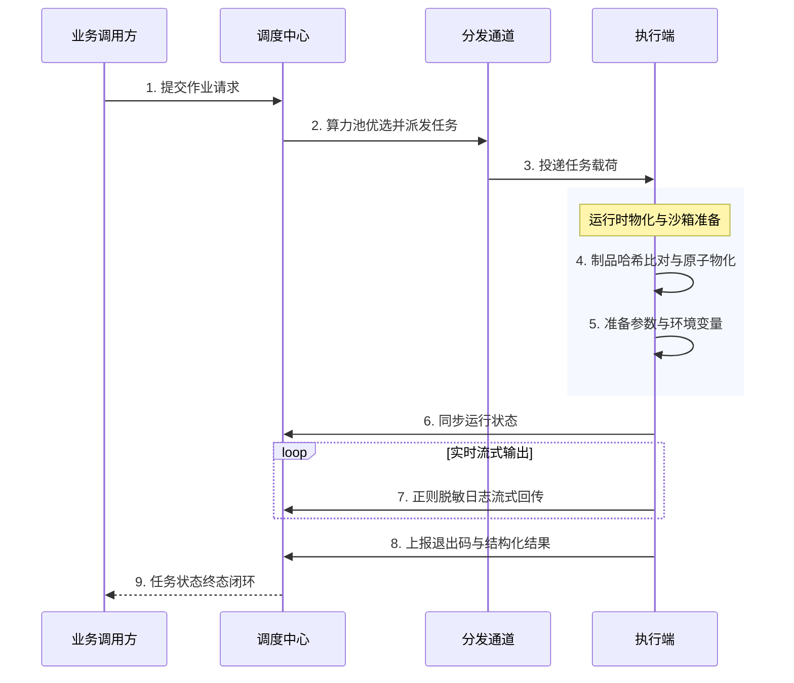

# 架构与调度拓扑

ETask 是专为自动化运维与异构作业设计的分布式异步任务执行系统，采用**控制面与执行面完全解耦**架构，实现多语言脚本驱动、边缘隔离区穿透与大规模算力池智能路由。

- **源码仓库**：[GitHub: Duke1616/etask](https://github.com/Duke1616/etask)
- **服务契约**：调度控制面 HTTP RESTful (`:8765`) / gRPC (`:9002`)、执行端 gRPC (`:9004`)、Kafka 异步总线
- **核心底座**：Golang、MySQL 8.0+、Redis 7.0+、Etcd 3.5+、Kafka、MinIO (S3 制品库)

---

## 核心架构分层

系统划分为**调度控制面**、**通信存储层**与**分布式执行端**三大核心域，各层松耦合自治：

- **调度控制面**：负责作业工程化打包与多租户算力池智能路由，提供任务超时中断、自动重试与故障转移等全生命周期自愈补偿。
- **通信与存储层**：提供核心内网 gRPC 高速直推与隔离区 Kafka 异步总线双通道；MinIO 持久化不可变制品，Etcd/Redis 负责租约发现与集群协调。
- **分布式执行端**：统一 Shell / Python / Ansible 多语言执行运行时，具备依赖分层物化、进程组级联强杀与日志流式脱敏能力，并支持标准 SDK 扩展。

---

## 运行角色与选型矩阵

ETask 采用单二进制多模式设计，根据不同部署场景提供多种核心角色：

| 运行角色 | 核心定位与适用场景 |
| :--- | :--- |
| **调度中心** | 纯控制面服务，负责全局智能路由、状态推进与四维异常补偿，宿主无需预装脚本执行环境。 |
| **隔离区 Agent** | 边缘执行端，单向出站连接 Kafka 消费任务并回传，**零入站端口暴露**，专为 DMZ 与隔离网络设计。 |
| **直连 Executor** | 核心内网执行端，提供 gRPC 接口，默认采用微秒级直推，面向低延迟高速内网。 |
| **单机全功能** | 聚合调度控制面与本地执行引擎，用于本地开发调试或边缘一体化开箱即用。 |

::: tip 执行端统一底层运行时
`agent` 与 `executor` 仅是接入总线的网络协议不同。一旦接收到任务载荷，**底层完全共享同一套执行运行时**，负责统一的制品物化解压、多语言脚本驱动、进程组级联强杀与流式脱敏。
:::

::: tip 开放执行器 SDK 生态
ETask 提供开放的 **`sdk/executor`**：除内置 Shell / Python / Ansible 引擎外，开发者可实现标准 `Handler` 契约自由定制私有执行引擎（如 Terraform、SQL、容器作业等），引擎能力与入参元数据自动随节点租约向中心注册。
:::

---

## 任务分发通道选型对比

针对企业异构网络拓扑，ETask 规范了 gRPC（内置 PUSH 与 PULL 模式）与 Kafka 异步总线两种传输通道：

| 传输通道 | 调度模式 | 适用网络拓扑 | 连接与交互方向 | 节点端口要求 | 削峰与过载保护 |
| :--- | :--- | :--- | :--- | :--- | :--- |
| **gRPC** | **PUSH (直推)** | 核心内网、双向互通的高速局域网 | 调度中心主动连向执行节点分发 | 节点需开放监听端口 (如 `9004`) | 基于节点并发配额实时反压 |
| **gRPC** | **PULL (拉取)** | 核心内网受限区、中心无法反向直连的节点 | 执行节点主动向调度中心发起长轮询拉取 | **零开放入站端口** (仅单向出站) | 任务在调度端就地等待，节点按自身算力主动抢占 |
| **Kafka** | **异步消费** | 跨防火墙 DMZ 隔离区、跨云混合网、边缘环境 | 边缘 Agent 单向出站外联消息队列 | **零开放入站端口** (仅单向出站 `9092`) | 分区持久化缓冲削峰，调度端停机发版任务保序不丢失 |

---

## 任务执行全链路时序

任务从提交到最终归档的全生命周期流转如下：

---

## 微服务协同与生态边界

根据平台微服务矩阵准则，ETask 专注于**分布式异步作业执行**，各服务独立部署、按需网状调用：

* **与 EFlow 协同**：EFlow 流程引擎在工单审批通过后，按需异步调用 ETask 下发运维任务；
* **与 ECMDB 协同**：ETask 巡检与采集脚本获取服务器硬件配置后，可按需调用 ECMDB API 回写资产拓扑。
