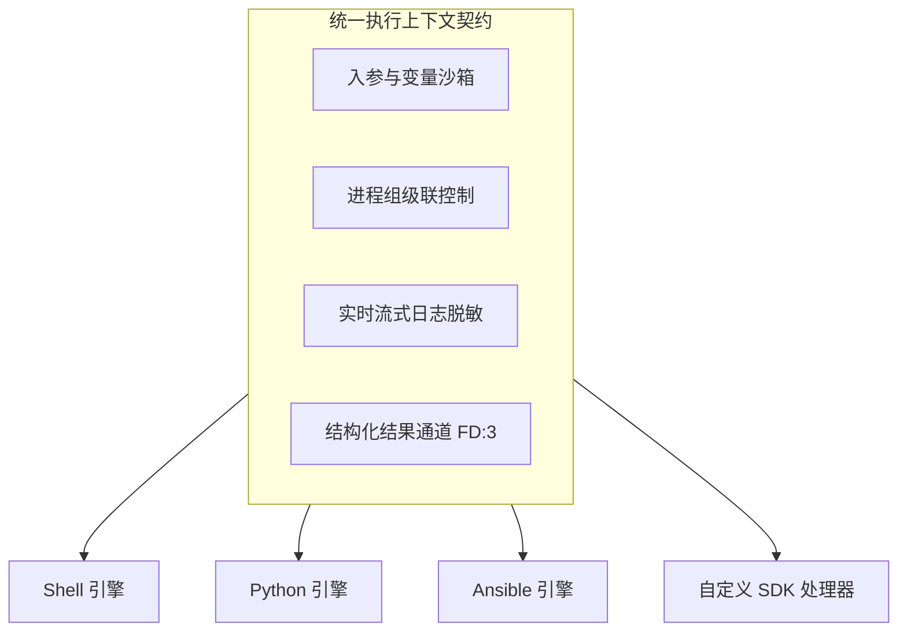

# 异构执行引擎概览

ETask 执行端采用**可插拔处理器（Handler）架构**与**统一执行上下文契约**。既原生内置了针对主流自动化脚本（Shell、Python、Ansible）的标准驱动支持，又提供了开放的 `sdk/executor`，供开发者将私有作业逻辑与运维工具无缝接入分布式调度集群。

---

## 1. 统一执行模型与运行时保障

执行端为所有异构引擎抽象了通用的执行上下文，并从操作系统底层提供高可靠的沙箱保障机制：

### 核心运行时保障

* **进程组级联强杀**：子进程开启独立 POSIX 进程组（`Setpgid: true`），超时或取消时直接向负进程组（`-PID`）发送 `SIGKILL`，杜绝孤儿进程泄漏。
* **实时流式与本地脱敏**：非阻塞管道捕获 `stdout/stderr` 毫秒级上报，凭据与敏感字段在执行端本地经正则替换（`******`）后再传输。
* **结构化结果回传（FD 3）**：保留文件描述符 `3`（`EWORK_RESULT_FD`）供脚本直接回传 JSON 键值对，无需上游反向文本正则解析。
* **沙箱工作区隔离**：任务独占临时目录（`ETASK_WORKSPACE_ROOT`），退出后即时物理销毁，保持无状态。

---

## 2. 代码来源形态：内联脚本 vs 工程项目

交由引擎执行的代码主要划分为两类形态：

| 对比维度 | 内联脚本（Inline） | 工程项目（Project） |
| :--- | :--- | :--- |
| **形态本质** | 单段纯文本或单文件脚本 | 具备目录结构的工程包（ZIP / Tar） |
| **下发方式** | 随任务指令直接下发数据库/内存，**零下载与解压开销** | 存入对象存储，执行节点基于哈希校验拉取解压并挂载 |
| **入口机制** | 就地物化临时文件直接执行 | 必须指定工程内相对入口路径（如 `bin/run.sh`） |
| **典型场景** | 即席排障命令、轻量巡检片段（≤ 30 行） | 复杂发布系统、多文件 Python 项目、Ansible 剧本 |
| **支持引擎** | **Shell**、**Python** | **Shell**、**Python**、**Ansible** |

---

## 3. 执行引擎选型矩阵与深入指南

ETask 将不同语言与工具的执行细节解耦收敛在独立子模块中，请根据实际业务场景查阅对应专题指南：

| 引擎分类 | 适用语言 / 工具 | 交付形态 | 核心特色 | 深入文档 |
| :--- | :--- | :--- | :--- | :--- |
| **Shell** | Bash / POSIX sh | 内联 / 工程 | 零额外开销、环境变量与 `$ETASK_ARGS_FILE` 自动注入 | [Shell 脚本执行](/task/runner/shell) |
| **Python** | Python 3.x | 内联 / 工程 | `PYTHONUNBUFFERED=1` 流式输出、跨层制品库自动装载 | [Python 脚本执行](/task/runner/python) |
| **Ansible** | Ansible Playbook | 工程项目 | 独占沙箱重定向、受控端免密授权与凭据物理隔离 | [Ansible 剧本编排](/task/runner/ansible) |
| **自定义 SDK** | Go / 微服务 | 独立服务 | 原生 gRPC 协议接入、前后端表单动态驱动、自研运维系统集成 | [自定义执行器开发 (SDK)](/task/runner/custom) |
