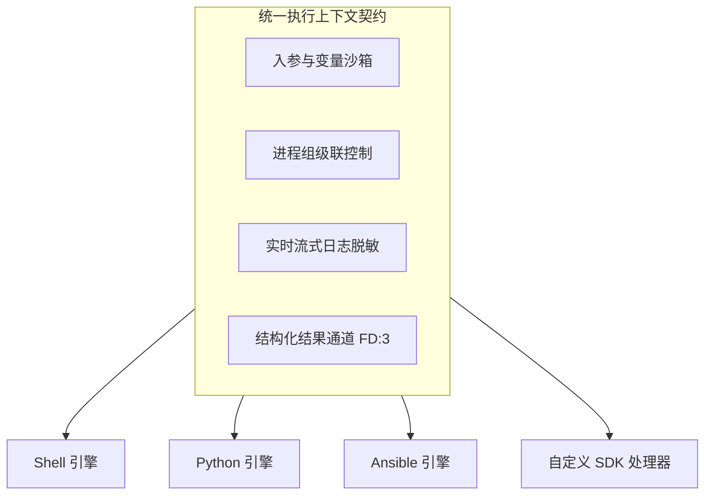

# 异构执行引擎与 SDK

ETask 执行端采用**可插拔处理器（Handler）架构**与**统一执行上下文契约**。既原生内置了针对主流自动化脚本（Shell、Python、Ansible）的标准驱动支持，又提供了独立的 `sdk/executor`，供开发者将私有作业逻辑与运维工具无缝接入分布式调度集群。

---

## 1. 统一执行模型与运行时保障

执行端为所有异构引擎抽象了通用的执行上下文，并从操作系统底层提供高可靠的沙箱保障机制：



### 核心运行时保障

* **进程组级联强杀**：子进程开启独立 POSIX 进程组（`Setpgid: true`），超时或取消时直接向负进程组（`-PID`）发送 `SIGKILL`，杜绝孤儿进程泄漏。
* **实时流式与本地脱敏**：非阻塞管道捕获 `stdout/stderr` 毫秒级上报，凭据与敏感字段在执行端本地经正则替换（`******`）后再传输。
* **结构化结果回传（FD 3）**：保留文件描述符 `3`（`EWORK_RESULT_FD`）供脚本直接回传 JSON 键值对，无需上游反向文本正则解析。
* **沙箱工作区隔离**：任务独占临时目录（`ETASK_WORKSPACE_ROOT`），退出后即时物理销毁，保持无状态。

---

## 2. 代码来源形态：内联脚本 vs 工程项目

交由引擎执行的代码主要划分为两类形态：

| 对比维度 | 内联脚本（Inline） | 工程项目（Project） |
| :--- | :--- | :--- |
| **形态本质** | 单段纯文本或单文件脚本 | 具备目录结构的工程包（ZIP / Tar） |
| **下发方式** | 随任务指令直接下发数据库/内存，**零下载与解压开销** | 存入对象存储，执行节点基于哈希校验拉取解压并挂载 |
| **入口机制** | 就地物化临时文件直接执行 | 必须指定工程内相对入口路径（如 `bin/run.sh`） |
| **典型场景** | 即席排障命令、轻量巡检片段（≤ 30 行） | 复杂发布系统、多文件 Python 项目、**Ansible 剧本** |
| **支持引擎** | **Shell**、**Python** | **Shell**、**Python**、**Ansible** |

---

## 3. 原生脚本执行引擎契约

* **Shell**：支持内联与工程项目；环境变量预打入子进程（可直接 `$VAR` 或 `source "$ETASK_SHELL_ENV_FILE"` 读取）；入参从受控文件 `$ETASK_ARGS_FILE`（`0600`）读取。
* **Python**：默认注入 `PYTHONUNBUFFERED=1` 保证无缓冲实时日志；制品库与租户层自动追加至 `PYTHONPATH` 首位；入参与变量通过 JSON 文件注入，防范注入攻击。
* **Ansible**：**仅支持工程项目**；`ANSIBLE_HOME` 重定向至独占工作区，避免凭据与 SSH 指纹污染；剧本内严禁硬编码秘钥，通过别名关联 `etask_credential_ref`（详见 [Ansible 凭据与受控端互信](/task/ansible-credential)）。

---

## 4. 执行端 SDK 架构与核心 API

官方 `sdk/executor` 采用轻量化分层设计：

* **`sdk/executor`**：轻量核心契约包，定义 `TaskHandler` 接口与 `Context` 交互。
* **`sdk/executor/node`**：标准 gRPC 节点运行时，负责心跳保活、服务注册发现与 PUSH/PULL 任务调度。

### 上下文（Context）核心 API

| 核心方法 | 职责说明 |
| :--- | :--- |
| `ctx.GetResolvedParam(key)` | 按 Handler 元数据绑定规则安全解析并读取业务入参 |
| `ctx.Log(format, args...)` | 记录流式业务日志（执行端本地自动完成敏感信息脱敏） |
| `ctx.ReportProgress(percent)` | 上报标准化任务执行进度（`0 ~ 100`） |
| `ctx.SetResult(key, value)` | 设置结构化业务执行结果，供下游系统、工作流或工单精准引用 |

### 前后端表单动态渲染契约（Metadata 规范）

控制台在配置任务或工单提单时，依靠执行器 `Metadata()` 上报的元数据动态渲染交互表单。编写处理器前需了解该约定：

#### 1. 参数基础属性（Parameter）

| 字段 | 类型 | 说明与前端交互行为 |
| :--- | :--- | :--- |
| `Key` | `string` | 参数唯一标识 |
| `Desc` | `string` | 参数描述，作为前端表单项 Label 或 Tooltip 悬浮提示 |
| `Required` | `bool` | 是否必填；为 `true` 时前端表单标红并在提交时进行拦截校验 |
| `Secret` | `bool` | 是否为敏感字段；为 `true` 时前端输入框以密码掩码展示，服务端强制加密落盘 |
| `Default` | `string` | 缺省默认值，表单初始化时自动填充 |
| `RuntimeOverridable` | `bool` | 是否允许在发起任务触发（或工单审批）时动态传参覆盖 |

#### 2. 输入模式与前端组件契约（Bindings & Component）

一个参数可通过 `Bindings` 支持多种输入模式（如手工填写 vs 引用环境变量），前端根据 Map 的 Key 渲染切换 Tab：

* **模式 Key 约定**：`"static"`（静态固定值输入）、`"runner"`（执行单元变量引用）。
* **UI 组件类型（`Component`）与扩展配置（`Config`）**：

| `Component` 取值 | 适用场景与前端组件形态 | `Config` 扩展参数约定 |
| :--- | :--- | :--- |
| **`input`** | 单行文本输入框（普通字符串、IP、端口等） | 无需额外配置 |
| **`code-editor`** | 高级代码/表达式编辑器（PromQL、JSON、SQL 等） | `{"language": "promql" \| "json" \| "shell" \| "yaml"}` 指定高亮语法 |
| **`select-input`** | 枚举下拉选择框 | `{"options": "[{\"label\":\"显示名\",\"value\":\"真实值\"}]"}` 提供选项列表 |
| **`kv-input`** | 键值对列表输入组件（如自定义环境变量列表） | 无需额外配置 |
| **`runner-picker`** | 专用的执行单元引用选择器 | 无需额外配置 |

::: code-group

```go [input]
// 单行文本输入框（用于普通文本、主机地址、端口等）
executor.Parameter{
    Key: "endpoint", Desc: "监控服务地址", Required: true,
    Bindings: map[string]executor.Binding{
        "static": &executor.BindingOption{
            Label:       "静态地址",
            Placeholder: "http://10.0.0.1:9090",
            Component:   "input",
        },
    },
}
```

```go [code-editor]
// 高级代码/表达式编辑器（通过 Config.language 指定语法高亮，如 promql / json / shell / yaml / sql）
executor.Parameter{
    Key: "query", Desc: "PromQL 查询语句", Required: true,
    Bindings: map[string]executor.Binding{
        "static": &executor.BindingOption{
            Label:       "手动输入",
            Placeholder: "avg_over_time(DCGM_FI_DEV_GPU_UTIL[5m]) == 0",
            Component:   "code-editor",
            Config:      map[string]string{"language": "promql"},
        },
    },
}
```

```go [select-input]
// 枚举下拉单选框（通过 Config.options 提供选项列表）
executor.Parameter{
    Key: "verbosity", Desc: "日志详细级别", Default: "0",
    Bindings: map[string]executor.Binding{
        "static": &executor.BindingOption{
            Label:     "选择级别",
            Component: "select-input",
            Config: map[string]string{
                "options": `[{"label":"标准日志","value":"0"},{"label":"调试日志 (-v)","value":"1"},{"label":"深度调试 (-vv)","value":"2"}]`,
            },
        },
    },
}
```

```go [kv-input]
// 键值对列表输入组件（如自定义环境变量、扩展参数等）
executor.Parameter{
    Key: "custom_variables", Role: executor.ParameterRoleVariables, Desc: "环境变量注入",
    Bindings: map[string]executor.Binding{
        "manual": &executor.BindingOption{
            Label:       "手动配置",
            Placeholder: `[{"key":"ENV","value":"prod","secret":false}]`,
            Component:   "kv-input",
        },
    },
}
```

```go [runner-picker]
// 专用的执行单元引用选择器（通常配合 Role: ParameterRoleVariables 使用）
executor.Parameter{
    Key: "variables", Role: executor.ParameterRoleVariables, Desc: "环境变量注入",
    Bindings: map[string]executor.Binding{
        "runner": &executor.BindingOption{
            Label:       "执行单元变量引用",
            Placeholder: "请选择执行单元...",
            Component:   "runner-picker",
        },
    },
}
```

:::

::: warning runner-picker 的后端特殊解析机制
`runner-picker` 与其他普通文本输入组件有着本质不同，它是**与调度控制面深度协同的系统级组件**：
1. **前端交互**：前端表单并不仅是录入字面值，而是调取集群执行单元列表供用户选择，提交的是执行单元的 ID（`runner_id`）；
2. **服务端解析（`RunnerResolver`）**：当绑定模式为 `"runner"` 时，调度中心在派发任务时会通过内置的 `RunnerResolver` 拦截，自动查询该执行单元绑定的**全量环境变量与解密凭据**（`ListMergedVariables`），并自动合并注入到任务的运行上下文中；
3. **使用规范**：该组件通常与 `Role: executor.ParameterRoleVariables` 配合用于环境变量参数声明，避免开发者在业务 Handler 中重复手写解析逻辑。
:::

---

## 5. 自定义处理器开发实战

掌握了上下文交互与 Metadata 规范后，即可编写具体的处理器业务逻辑。参考生产级规范实现一个指标巡检处理器：

```go
package handler

import (
	"fmt"
	"time"

	"github.com/Duke1616/etask/sdk/executor"
)

type MetricsQueryHandler struct{}

func (MetricsQueryHandler) Name() string { return "metrics_query" }
func (MetricsQueryHandler) Desc() string { return "服务指标与资源合规性巡检处理器" }

// Metadata 声明处理器入参元数据（驱动控制台动态渲染输入组件）
func (MetricsQueryHandler) Metadata() []executor.Parameter {
	return []executor.Parameter{
		{
			Key: "endpoint", Desc: "监控服务地址", Required: true,
			Bindings: map[string]executor.Binding{
				"static": &executor.BindingOption{
					Label:       "静态地址",
					Placeholder: "http://10.0.0.1:9090",
					Component:   "input",
				},
			},
		},
		{
			Key: "query", Desc: "查询表达式", Required: true,
			Bindings: map[string]executor.Binding{
				"static": &executor.BindingOption{
					Label:       "表达式输入",
					Placeholder: "up == 0",
					Component:   "code-editor",
					Config:      map[string]string{"language": "promql"},
				},
			},
		},
	}
}

// Run 执行核心业务逻辑
func (MetricsQueryHandler) Run(ctx *executor.Context) error {
	endpoint, _ := ctx.GetResolvedParam("endpoint")
	query, _ := ctx.GetResolvedParam("query")

	ctx.Log("🚀 开始执行指标巡检: %s", endpoint)
	ctx.ReportProgress(20)

	// 模拟执行查询逻辑
	time.Sleep(300 * time.Millisecond)
	ctx.ReportProgress(80)

	// 写入结构化业务结果，供上游流程或工单消费
	ctx.SetResult("anomaly_count", 0)
	ctx.SetResult("status", "HEALTHY")

	ctx.Log("✅ 巡检完成，未发现异常节点")
	ctx.ReportProgress(100)
	return nil
}
```

---

## 6. 启动标准执行节点服务

使用 `sdk/executor/node` 快速拉起执行节点服务，自动完成注册中心注册与长轮询/直推调度接入：

```go
package main

import (
	"github.com/Duke1616/etask/pkg/grpc"
	"github.com/Duke1616/etask/sdk/executor/node"
	"github.com/gotomicro/ego"
)

func main() {
	cfg := node.Config{
		Mode:           node.ModePull, // 调度拉取模式 (pull / push)
		Desc:           "专用资源巡检执行器",
		IsolationLevel: node.IsolationShared,
		Server: grpc.ServerConfig{
			ServiceName: "metrics-executor",
			ListenAddr:  "0.0.0.0:9004",
		},
		Client: grpc.ClientConfig{
			Name: "scheduler",
		},
	}

	// 注册自定义处理器并接入注册中心（如 etcd registry）
	exec, err := node.New(cfg, registry, &handler.MetricsQueryHandler{})
	if err != nil {
		panic(err)
	}

	// 由 EGO 驱动运行，提供优雅下线与服务保活
	if err := ego.New().Serve(exec).Run(); err != nil {
		panic(err)
	}
}
```

