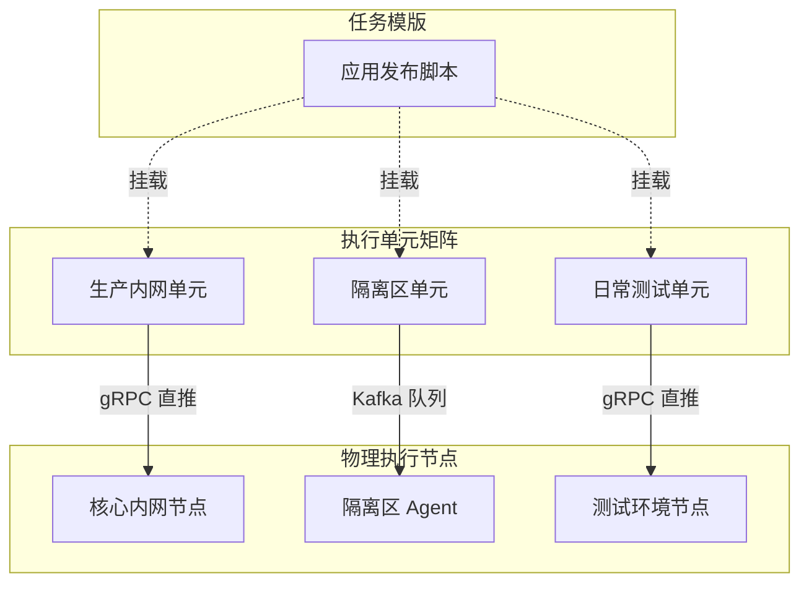

# 执行单元与调度路由

执行单元是 ETask 架构中连接**“业务脚本代码”**与**“物理执行算力”**的核心解耦中枢。通过执行单元，用户可以实现同一套脚本在不同网络环境、不同算力池中的一码多用与灵活路由。

---

## 1. 执行单元的核心定位

在传统的运维工具中，脚本往往直接与固定的机器 IP 或 SSH 账号绑定，环境迁移成本极高。ETask 引入执行单元，将**业务逻辑**与**运行环境**彻底分离：



* **逻辑解耦**：脚本模版只专注于“执行什么代码”，而不关心目标机器的 IP、认证方式或网络拓扑；
* **一码多用**：单个任务模版可同时挂载多个执行单元，分别对应开发测试、生产核心、DMZ 隔离区等多套异构环境，无需复制多份脚本；
* **环境隔离**：不同执行单元独立配置环境变量与凭证，避免生产凭证泄露到测试环境。

---

## 2. 执行单元的核心配置要素

每个执行单元承载了一次作业执行所需的全部调度与环境上下文：

| 配置字段 | 核心职责 | 说明与典型取值 |
| :--- | :--- | :--- |
| **通道类型** | 定义任务的分发协议与传输方式 | • `GRPC`：适用于核心内网或双向互通的高速网络<br/>• `KAFKA`：适用于跨防火墙 DMZ 隔离区、边缘混合云<br/>*(注：底层网络选型与端口策略详见 [架构与调度拓扑：任务分发通道选型对比](architecture.md#任务分发通道选型对比))* |
| **执行目标** | 绑定物理节点池或消息队列管道 | • gRPC 模式下对应逻辑资源池名称（如 `pool:prod-bj`）<br/>• Kafka 模式下对应派发的专属消息 Topic |
| **执行处理器** | 指定驱动脚本运行的执行引擎 | 支持内置引擎（`shell`, `python`, `ansible`）或基于 SDK 扩展的私有执行器 |
| **私有环境变量** | 注入该运行环境专属的上下文与凭证 | 支持敏感字段安全加密落盘（`secret: true`），执行时直接注入进程环境 |
| **默认参数** | 定义该环境下处理器的缺省入参 | 可配置环境特有的基础入参，单次触发未传参时自动生效兜底 |

---

## 3. 多环境解耦配置实践

单个脚本模版无需复制多份，只需在控制台挂载不同执行单元，即可在不同网络与算力池中安全复用：

::: code-group

```yaml [生产核心执行单元]
name: prod-core-runner
kind: GRPC
target: pool:prod-core
handler: shell
variables:
  - key: TARGET_CLUSTER
    value: k8s-prod-bj-01
  - key: DEPLOY_ENV
    value: production
  - key: DB_PASSWORD
    value: ENC:V1:a8f93c... # 敏感凭证加密注入
```

```yaml [日常测试执行单元]
name: test-env-runner
kind: GRPC
target: pool:test-cluster
handler: shell
variables:
  - key: TARGET_CLUSTER
    value: k8s-test-01
  - key: DEPLOY_ENV
    value: testing
  - key: DB_PASSWORD
    value: test_pass_123 # 测试环境常规凭证
```

```yaml [DMZ 隔离区执行单元]
name: dmz-edge-runner
kind: KAFKA
target: topic-etask-dmz
handler: shell
variables:
  - key: PROXY_GATEWAY
    value: https://10.200.0.1:8443
  - key: INGRESS_CHECK
    value: "true"
```

:::


