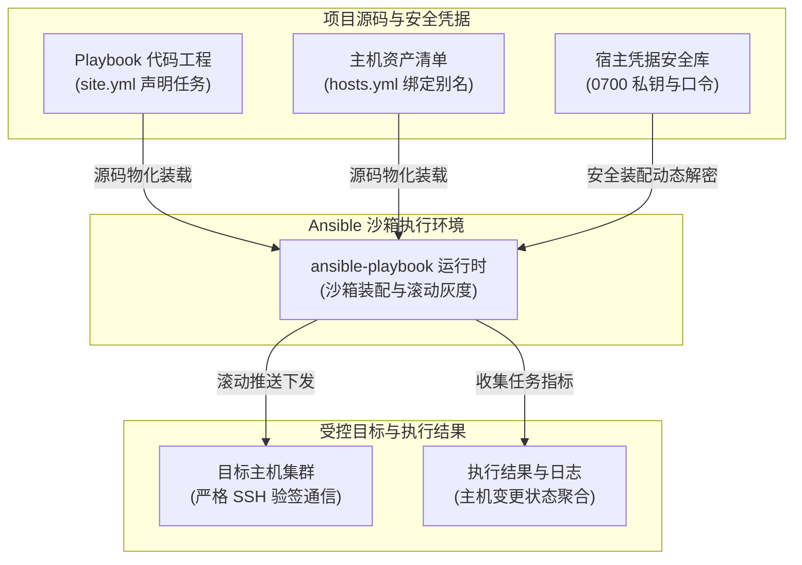

# Ansible 剧本编排

ETask 原生深度集成了 Ansible 自动化运维能力。核心设计原则是 **代码与认证材料物理隔离**：Playbook 仓库中绝不硬编码私钥或密码，仅声明凭据别名（如 `production-linux`），并在执行瞬间由节点沙箱动态注入。



---

## 1. 快速上手（最小工作模板）

Ansible **仅支持项目级执行**，必须包含入口剧本文件（如 `site.yml`）与主机清单：

::: code-group

```yaml [site.yml (主剧本)]
---
- name: 生产集群滚动发布与健康校验
  hosts: production_nodes
  serial: "50%"       # 滚动灰度：每次执行 50% 节点，保障业务连续性
  gather_facts: yes   # 收集目标主机系统指纹
  become: yes

  # 1. 前置检查与动态入参校验
  pre_tasks:
    - name: 探测受控主机 SSH 互信与 Python 环境
      ansible.builtin.ping:

    - name: 校验动态入参 deploy_version
      ansible.builtin.assert:
        that:
          - deploy_version is defined
          - deploy_version | length > 0
        fail_msg: "未检测到有效的发布版本号 deploy_version，作业中止"

  # 2. 核心部署任务
  tasks:
    - name: 同步应用服务配置文件
      ansible.builtin.template:
        src: templates/app.conf.j2
        dest: /etc/app/app.conf
        owner: root
        group: root
        mode: "0644"
      notify: 优雅重载业务服务

  # 3. 后置业务探针校验
  post_tasks:
    - name: 验证服务端口就绪
      ansible.builtin.wait_for:
        port: 8080
        delay: 2
        timeout: 15
        state: started

  # 4. 触发式事件处理器 (幂等防震荡)
  handlers:
    - name: 优雅重载业务服务
      ansible.builtin.systemd:
        name: app-service
        state: reloaded
```

```yaml [inventory/hosts.yml (主机清单)]
---
all:
  children:
    production_nodes:
      vars:
        # 绑定 ETask 宿主凭据安全库别名 (沙箱动态装配私钥，代码库零密钥暴露)
        etask_credential_ref: production-linux
        ansible_port: 22
        ansible_user: ops_admin
      hosts:
        10.0.1.11:
          node_role: primary
        10.0.1.12:
          node_role: secondary
```

:::

---

## 2. 凭据隔离与受控端互信

### 2.1 凭据解耦与宿主权限底线

控制节点（Runner / Executor）上的凭据目录设有严格的系统级安全检测：

* **目录权限底线 `0700`**：`credential_root` 严禁其他用户访问；
* **文件权限底线 `0600`**：私钥与密码文件仅允许属主读写；
* 若权限配置过宽，节点启动时将**主动报错并阻断退出**，拒绝带病运行。

```bash
# 宿主凭据安全初始化
mkdir -p /run/credentials/etask-ansible && chmod 700 /run/credentials/etask-ansible
touch /run/credentials/etask-ansible/production-linux-key && chmod 600 /run/credentials/etask-ansible/*

# 密码型凭据 (type: password) 宿主必须预装 sshpass
apt-get install -y sshpass || yum install -y sshpass
```

### 2.2 受控端免密授权

```bash
# 1. 在控制端从私钥提取公钥
ssh-keygen -y -f /run/credentials/etask-ansible/production-linux-key > production-linux.pub

# 2. 追加至目标受控节点的 ~/.ssh/authorized_keys (权限严格设为 0600)
cat production-linux.pub >> ~/.ssh/authorized_keys
chmod 600 ~/.ssh/authorized_keys && chmod 700 ~/.ssh

# 3. 控制节点采集目标主机 SSH 指纹 (防中间人劫持，ETask 强制开启严格验签)
ssh-keyscan -H 10.0.1.11 10.0.1.12 >> /etc/etask/ssh/known_hosts
```

::: tip 排错锦囊
若执行报 `Permission denied (publickey)`，多为受控端 `~/.ssh` 拥有组写权限（如 `775`）或 `authorized_keys` 超过 `600`，被 SSHD 的 `StrictModes` 机制拦截。
:::

---

## 3. 动态入参与 Extra Vars 编排

当需要从工单表单或调度触发端传递动态参数（如升级版本号）时，ETask 会将入参自动转换为 `--extra-vars` 注入剧本：

```yaml
tasks:
  - name: 校验上游动态传入的发布版本号
    ansible.builtin.assert:
      that:
        - deploy_version is defined
        - deploy_version | length > 0
      fail_msg: "请通过任务入参传递 deploy_version 变量！"

  - name: 更新软件版本包
    ansible.builtin.copy:
      src: "/opt/packages/app-{{ deploy_version }}.tar.gz"
      dest: "/opt/app/release.tar.gz"
```

---

## 4. 推荐工程目录结构

```text
my-ansible-project/
├── site.yml                 # 主入口剧本 (在任务模版入口路径中指定)
├── inventory/
│   └── hosts.yml            # 声明主机组与 etask_credential_ref 凭据绑定
└── roles/                   # (可选) 标准 Ansible Role 模块
    └── app/
        ├── tasks/main.yml
        └── handlers/main.yml
```
