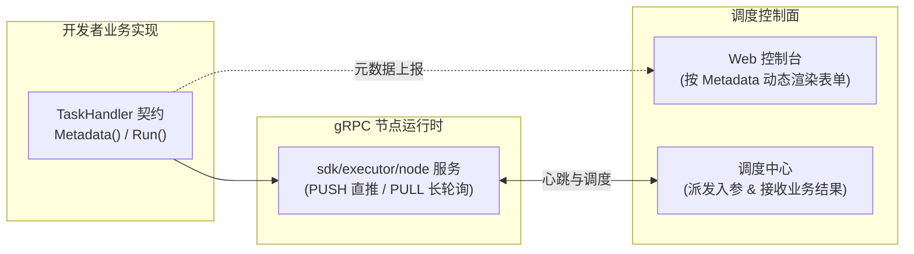

# 自定义执行器开发（SDK）

除了原生内置的 Shell、Python 与 Ansible 引擎外，ETask 提供了官方开放的 **`sdk/executor`**。开发者只需实现标准的 `TaskHandler` 接口，即可将企业私有运维逻辑（如 Terraform、Prometheus 告警演练、Kubernetes Job 等）以微服务形式无缝接入调度集群。



---

## 1. 快速上手（最小工作模板）

以下为满足 ETask 规范的最小自定义处理器实现：

```go
package handler

import (
	"fmt"
	"net/http"
	"time"

	"github.com/Duke1616/etask/sdk/executor"
)

type HttpCheckHandler struct{}

func (HttpCheckHandler) Name() string { return "http_check" }
func (HttpCheckHandler) Desc() string { return "HTTP 服务健康探测执行器" }

// 1. 声明入参元数据（驱动控制台自动渲染动态输入表单）
func (HttpCheckHandler) Metadata() []executor.Parameter {
	return []executor.Parameter{
		{
			Key: "endpoint", Desc: "探测目标 URL", Required: true,
			Bindings: map[string]executor.Binding{
				"static": &executor.BindingOption{
					Label:       "目标地址",
					Placeholder: "https://api.example.com/healthz",
					Component:   "input",
				},
			},
		},
		{
			Key: "timeout_sec", Desc: "请求超时时间 (秒)", Default: "5",
			Bindings: map[string]executor.Binding{
				"static": &executor.BindingOption{
					Label:       "超时时间",
					Placeholder: "5",
					Component:   "input",
				},
			},
		},
	}
}

// 2. 执行核心业务逻辑
func (HttpCheckHandler) Run(ctx *executor.Context) error {
	endpoint, _ := ctx.GetResolvedParam("endpoint")

	ctx.Log("开始对端点发起健康探测: %s", endpoint)
	ctx.ReportProgress(25)

	start := time.Now()
	client := &http.Client{Timeout: 5 * time.Second}
	resp, err := client.Get(endpoint)
	latency := time.Since(start).Milliseconds()

	if err != nil {
		ctx.Log("端点请求失败: %v", err)
		ctx.SetResult("status", "UNREACHABLE")
		return fmt.Errorf("服务不可达: %w", err)
	}
	defer resp.Body.Close()

	ctx.ReportProgress(80)
	ctx.Log("探测响应完成，HTTP 状态码: %d，耗时: %dms", resp.StatusCode, latency)

	// 向专用结果通道回传结构化指标，供下游工作流节点消费
	ctx.SetResult("status_code", resp.StatusCode)
	ctx.SetResult("latency_ms", latency)
	ctx.SetResult("status", "HEALTHY")

	ctx.ReportProgress(100)
	ctx.Log("健康探测成功结束")
	return nil
}
```

---

## 2. 上下文（Context）核心 API

每个任务被调度时，执行器为其分配独立的 `executor.Context`：

| 方法 | 职责说明 |
| :--- | :--- |
| **`ctx.GetResolvedParam(key)`** | 安全读取当前任务入参（已完成静态值或环境变量的自动解析） |
| **`ctx.Log(format, args...)`** | 输出流式业务日志（执行节点本地自动完成敏感词正则脱敏掩码） |
| **`ctx.ReportProgress(percent)`** | 上报阶段执行进度（`0 ~ 100`），平滑驱动控制台进度条 |
| **`ctx.SetResult(key, value)`** | 写入结构化业务结果，供后续工作流条件网关或审批变量直接引用 |

---

## 3. 前后端表单动态驱动规范 (Metadata)

ETask 拥有低代码表单驱动能力。Web 控制台与工单审批流**无需为私有执行器专门编写前端代码**，而是依赖处理器在 `Metadata()` 中声明的元数据，动态生成交互组件：

### 3.1 常用 UI 组件形态

::: code-group

```go [input (单行输入)]
executor.Parameter{
    Key: "endpoint", Desc: "服务地址", Required: true,
    Bindings: map[string]executor.Binding{
        "static": &executor.BindingOption{
            Label: "服务地址", Placeholder: "http://10.0.0.1:9090", Component: "input",
        },
    },
}
```

```go [code-editor (代码/表达式编辑器)]
executor.Parameter{
    Key: "query", Desc: "PromQL 表达式", Required: true,
    Bindings: map[string]executor.Binding{
        "static": &executor.BindingOption{
            Label: "表达式", Component: "code-editor",
            Config: map[string]string{"language": "promql"}, // 支持 promql / json / shell / yaml / sql
        },
    },
}
```

```go [select-input (下拉单选)]
executor.Parameter{
    Key: "level", Desc: "日志级别", Default: "INFO",
    Bindings: map[string]executor.Binding{
        "static": &executor.BindingOption{
            Label: "级别", Component: "select-input",
            Config: map[string]string{
                "options": `[{"label":"调试 (DEBUG)","value":"DEBUG"},{"label":"信息 (INFO)","value":"INFO"}]`,
            },
        },
    },
}
```

```go [runner-picker (执行单元变量引用)]
// 专用于引用执行单元的环境变量与解密凭据，调度中心在派发前自动拦截解析合并
executor.Parameter{
    Key: "variables", Role: executor.ParameterRoleVariables, Desc: "环境变量注入",
    Bindings: map[string]executor.Binding{
        "runner": &executor.BindingOption{
            Label: "执行单元引用", Placeholder: "请选择执行单元...", Component: "runner-picker",
        },
    },
}
```

:::

---

## 4. 节点服务装配与启动

使用 `sdk/executor/node` 包拉起节点服务，自动完成注册中心注册与服务保活：

```go
package main

import (
	"my-executor/handler"

	"github.com/Duke1616/etask/pkg/grpc"
	"github.com/Duke1616/etask/sdk/executor/node"
	"github.com/gotomicro/ego"
)

func main() {
	cfg := node.Config{
		Mode:           node.ModePull, // 调度拉取模式 (pull / push)
		Desc:           "专用运维扩展执行器",
		IsolationLevel: node.IsolationShared,
		Server: grpc.ServerConfig{
			ServiceName: "custom-executor",
			ListenAddr:  "0.0.0.0:9004",
		},
		Client: grpc.ClientConfig{
			Name: "scheduler",
		},
	}

	// 注册自定义处理器并接入注册中心
	exec, err := node.New(cfg, registry, &handler.HelloHandler{})
	if err != nil {
		panic(err)
	}

	// 由 EGO 驱动运行，提供优雅下线与服务保活
	if err := ego.New().Serve(exec).Run(); err != nil {
		panic(err)
	}
}
```
