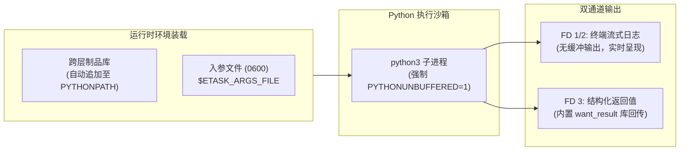

# Python 脚本执行

ETask 针对 Python 提供了定制化的执行沙箱。具备**无缓冲毫秒级流式日志（Unbuffered Output）**、**文件级参数反序列化**与**跨层制品自动装载（PYTHONPATH 自动追加）**能力。



---

## 1. 快速上手（最小工作模板）

以下为满足 ETask 生产规范的标准 Python 脚本模板，包含动态参数解析与官方内置库结果回传：

```python
#!/usr/bin/env python3
# -*- coding: utf-8 -*-

import json
import os
import sys

# 1. 跨层依赖引用：直接从 etask 系统公共库引入结果回传工具
try:
    from etask.third_party.base.want_result import want_result
except ImportError:
    want_result = None

def main():
    # 2. 从入参文件安全解析动态入参 (0600 只读 JSON)
    args = {}
    args_file = os.environ.get("ETASK_ARGS_FILE")
    if args_file and os.path.exists(args_file):
        with open(args_file, "r", encoding="utf-8") as f:
            args = json.load(f)

    target_env = args.get("env", "staging")
    print(f"[info] 开始执行任务，目标环境: {target_env}")

    # 3. 模拟业务处理
    success_count = 10
    failed_count = 0

    # 4. 回传结构化结果 (推荐使用系统内置 want_result，供下游工作流消费)
    if want_result:
        want_result("env", target_env)
        want_result("success_count", success_count)
        want_result("failed_count", failed_count)
        want_result("status", "SUCCESS")
    else:
        # 本地脱离调度中心调试时自动降级
        print(f"[local] 模拟输出结果: success_count={success_count}")

    sys.exit(0)

if __name__ == "__main__":
    main()
```

---

## 2. 核心环境与输入契约

ETask 采用统一的文件沙箱传递参数，杜绝命令行参数注入攻击与进程列表信息泄露：

| 变量 / 文件 | 访问权限 | 核心作用与使用方法 |
| :--- | :--- | :--- |
| **`$ETASK_ARGS_FILE`** | `0600` (只读) | **业务动态入参**：上游传递的 JSON 文件，通过 `json.load(open(path))` 解析 |
| **`$ETASK_VARIABLES_FILE`** | `0600` (只读) | **环境变量与凭据**：Runner 解密注入的敏感配置映射，在代码中不硬编码凭据 |
| **`PYTHONUNBUFFERED=1`** | 自动注入 | **日志无缓冲**：强制关闭标准输出缓冲区，确保 `print()` 毫秒级流式呈现在控制台 |
| **`$ETASK_WORKSPACE_ROOT`** | 独占目录 | **沙箱工作区**：任务私有临时目录，任务结束自动物理清理 |

---

## 3. 依赖管理与模块自动装载 (PYTHONPATH)

在分布式任务执行中，任务前执行 `pip install` 会带来严重的延迟与网络依赖风险。ETask 采用**跨层制品库自动并联挂载机制**：

```python
# 执行节点拉起 python3 时，已将系统制品与租户制品自动注入 sys.path 首位:
# PYTHONPATH="$ETASK_SYSTEM_ROOT:$ETASK_ARTIFACT_ROOT:$PYTHONPATH"
```

### 开箱即用的模块导入

ETask 官方部署镜像已内置了基础通信与工具包。执行节点在拉起脚本时，会将挂载的系统制品库与租户制品库自动追加至 `sys.path` 首位，开发者可直接开箱 `import`：

```python
# 直接引入系统底层工具模块 (镜像内置并发布为系统制品)
from etask.third_party.base.want_result import want_result

# 引入租户级自研通用库
from ops_common.scripts import helper
```

---

## 4. 结构化结果回传通道（FD 3 与 want_result）

在需要将作业统计指标或业务结果供下游工作流分支判定时，ETask 提供两种回传方式：

### 4.1 官方推荐：使用系统内置 `want_result`

系统官方提供的 `want_result` 模块已封装好 JSON 序列化与异常容错：

```python
from etask.third_party.base.want_result import want_result

# 写入键值对结果 (内部自动完成类型转换与持久化)
want_result("healthy_hosts", 128)
want_result("unhealthy_hosts", 0)
want_result("report_url", "https://oss.example.com/reports/health.html")
```

### 4.2 底层机制：标准库 `os.write(3, ...)`

`want_result` 底层向进程专属的文件描述符 3（FD 3）写入 JSON 二进制字节流。在无依赖脱机环境下，使用 Python 标准库即可直接操作：

```python
import json
import os

def set_result_raw(data: dict):
    """底层机制：向文件描述符 3 写入结构化字节流"""
    try:
        os.write(3, json.dumps(data, ensure_ascii=False).encode("utf-8"))
    except OSError:
        pass  # 避免脱离 ETask 沙箱直接本地运行时抛出 Bad file descriptor
```

* **工作流直接引用**：上游系统可在后续节点中通过 `${step_1.result.unhealthy_hosts}` 进行分支判断。

---

## 5. 最佳实践与异常治理

* **退出码约定**：成功显式调用 `sys.exit(0)`；业务失败抛出友好的 `[error]` 说明并以非 0 状态码退出（如 `sys.exit(1)`）；
* **流式日志脱敏**：执行节点内置敏感词过滤器，匹配已知凭据并自动替换为 `******`，但编写脚本时仍应主动遵循最小输出原则，避免直接 `print(config_dict)`。
