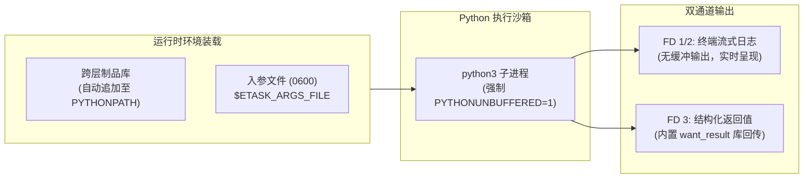

# Python 脚本执行

ETask 针对 Python 提供了定制化的执行沙箱。具备**无缓冲毫秒级流式日志（Unbuffered Output）**、**文件级参数反序列化**与**跨层制品自动装载（PYTHONPATH 自动追加）**能力。



---

## 1. 快速上手（最小工作模板）

以下为满足 ETask 生产规范的标准 Python 脚本模板，包含类型提示、毫秒级流式日志、入参防御性解析与官方结果回传：

```python
#!/usr/bin/env python3
# -*- coding: utf-8 -*-
"""
ETask 生产级 Python 作业脚本模板
特性：类型注解完备、结构化流式日志、沙箱入参安全反序列化与 FD 3 结果通道回传
"""

import json
import logging
import os
import sys
import time
from typing import Any, Dict

# 1. 配置毫秒级无缓冲流式日志 (结合 PYTHONUNBUFFERED=1 实时呈现)
logging.basicConfig(
    level=logging.INFO,
    format="%(asctime)s [%(levelname)s] %(message)s",
    datefmt="%Y-%m-%d %H:%M:%S",
    stream=sys.stdout,
)
logger = logging.getLogger("etask.job")

# 2. 跨层依赖导入：系统公共库结果回传工具
try:
    from etask.third_party.base.want_result import want_result
except ImportError:
    want_result = None


def load_task_args() -> Dict[str, Any]:
    """从沙箱环境安全反序列化入参文件 (0600 只读 JSON)"""
    args_path = os.environ.get("ETASK_ARGS_FILE")
    if not args_path or not os.path.exists(args_path):
        logger.warning("未检测到入参文件 $ETASK_ARGS_FILE，采用默认空配置")
        return {}

    try:
        with open(args_path, "r", encoding="utf-8") as f:
            return json.load(f)
    except Exception as err:
        logger.error(f"解析入参文件失败 [{args_path}]: {err}")
        raise


def report_results(metrics: Dict[str, Any]) -> None:
    """向专有通道 (FD 3) 回传结构化业务结果，供下游工作流分支判定"""
    for key, value in metrics.items():
        if want_result:
            want_result(key, value)
        else:
            logger.debug(f"[本地调试模拟] 回传指标 -> {key}: {value}")


def main() -> None:
    # 3. 加载并校验业务动态入参
    args = load_task_args()
    target_env = args.get("env", "staging")
    batch_size = int(args.get("batch_size", 50))

    logger.info(f"作业启动，目标环境: {target_env}，批次大小: {batch_size}")

    # 4. 执行核心业务逻辑
    start_time = time.time()
    success_count = batch_size
    failed_count = 0

    # 模拟业务操作耗时
    time.sleep(0.3)

    duration_sec = round(time.time() - start_time, 2)
    logger.info(f"作业执行完毕，耗时: {duration_sec}s, 成功: {success_count}, 失败: {failed_count}")

    # 5. 回传结构化业务指标
    report_results({
        "env": target_env,
        "success_count": success_count,
        "failed_count": failed_count,
        "duration_sec": duration_sec,
        "status": "SUCCESS" if failed_count == 0 else "FAILED",
    })

    if failed_count > 0:
        logger.error(f"存在业务失败条目 ({failed_count})，非零退出")
        sys.exit(1)

    sys.exit(0)


if __name__ == "__main__":
    try:
        main()
    except Exception as exc:
        logger.critical(f"未捕获的全局异常: {exc}", exc_info=True)
        sys.exit(1)
```

---

## 2. 核心环境与输入契约

ETask 采用统一的文件沙箱传递参数，杜绝命令行参数注入攻击与进程列表信息泄露：

| 变量 / 文件 | 访问权限 | 核心作用与使用方法 |
| :--- | :--- | :--- |
| **`$ETASK_ARGS_FILE`** | `0600` (只读) | **业务动态入参**：上游传递的 JSON 文件，通过 `json.load(open(path))` 解析 |
| **`$ETASK_VARIABLES_FILE`** | `0600` (只读) | **环境变量与凭据**：Runner 解密注入的敏感配置映射，在代码中不硬编码凭据 |
| **`PYTHONUNBUFFERED=1`** | 自动注入 | **日志无缓冲**：强制关闭标准输出缓冲区，确保 `print()` 毫秒级流式呈现在控制台 |
| **`$ETASK_WORKSPACE_ROOT`** | 独占目录 | **沙箱工作区**：任务私有临时目录，任务结束自动物理清理 |

---

## 3. 依赖管理与模块自动装载 (PYTHONPATH)

在分布式任务执行中，任务前执行 `pip install` 会带来严重的延迟与网络依赖风险。ETask 采用**跨层制品库自动并联挂载机制**：

```python
# 执行节点拉起 python3 时，已将系统制品与租户制品自动注入 sys.path 首位:
# PYTHONPATH="$ETASK_SYSTEM_ROOT:$ETASK_ARTIFACT_ROOT:$PYTHONPATH"
```

### 开箱即用的模块导入

ETask 官方部署镜像已内置了基础通信与工具包。执行节点在拉起脚本时，会将挂载的系统制品库与租户制品库自动追加至 `sys.path` 首位，开发者可直接开箱 `import`：

```python
# 直接引入系统底层工具模块 (镜像内置并发布为系统制品)
from etask.third_party.base.want_result import want_result

# 引入租户级自研通用库
from ops_common.scripts import helper
```

---

## 4. 结构化结果回传通道（FD 3 与 want_result）

在需要将作业统计指标或业务结果供下游工作流分支判定时，ETask 提供两种回传方式：

### 4.1 官方推荐：使用系统内置 `want_result`

系统官方提供的 `want_result` 模块已封装好 JSON 序列化与异常容错：

```python
from etask.third_party.base.want_result import want_result

# 写入键值对结果 (内部自动完成类型转换与持久化)
want_result("healthy_hosts", 128)
want_result("unhealthy_hosts", 0)
want_result("report_url", "https://oss.example.com/reports/health.html")
```

### 4.2 底层机制：标准库 `os.write(3, ...)`

`want_result` 底层向进程专属的文件描述符 3（FD 3）写入 JSON 二进制字节流。在无依赖脱机环境下，使用 Python 标准库即可直接操作：

```python
import json
import os

def set_result_raw(data: dict):
    """底层机制：向文件描述符 3 写入结构化字节流"""
    try:
        os.write(3, json.dumps(data, ensure_ascii=False).encode("utf-8"))
    except OSError:
        pass  # 避免脱离 ETask 沙箱直接本地运行时抛出 Bad file descriptor
```

* **工作流直接引用**：上游系统可在后续节点中通过 `${step_1.result.unhealthy_hosts}` 进行分支判断。

---

## 5. 最佳实践与异常治理

* **退出码约定**：成功显式调用 `sys.exit(0)`；业务失败抛出友好的 `[error]` 说明并以非 0 状态码退出（如 `sys.exit(1)`）；
* **流式日志脱敏**：执行节点内置敏感词过滤器，匹配已知凭据并自动替换为 `******`，但编写脚本时仍应主动遵循最小输出原则，避免直接 `print(config_dict)`。
