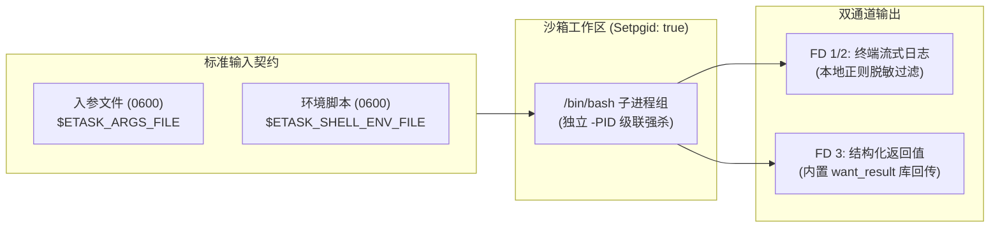

# Shell 脚本执行

ETask 原生支持 POSIX Shell（Bash）脚本执行，内置**独立进程组强杀**、**文件级参数沙箱**、**结构化结果管道（FD 3）**与**公共制品库跨层复用**能力。



---

## 1. 快速上手（最小工作模板）

以下为满足 ETask 生产规范的标准脚本模板，采用模块化函数组织，包含安全防护头、时间戳日志、入参解析、优雅退出与官方结果回传：

```bash
#!/usr/bin/env bash
# ==============================================================================
# ETask 标准 Shell 作业模板
# 特性：POSIX 进程组强杀兼容、入参沙箱防御解析、结构化指标回传与优雅退出清理
# ==============================================================================
set -euo pipefail

# ------------------------------------------------------------------------------
# 1. 运行时初始化与安全陷阱 (Trap)
# ------------------------------------------------------------------------------
log_info()  { echo "[$(date '+%Y-%m-%d %H:%M:%S')] [INFO]  $*"; }
log_warn()  { echo "[$(date '+%Y-%m-%d %H:%M:%S')] [WARN]  $*" >&2; }
log_error() { echo "[$(date '+%Y-%m-%d %H:%M:%S')] [ERROR] $*" >&2; }

cleanup() {
    local exit_code=$?
    if [[ $exit_code -ne 0 ]]; then
        log_error "作业执行异常终止，退出码: ${exit_code}"
    fi
}
trap cleanup EXIT INT TERM

# 跨层依赖引用：加载系统内置工具库 (含 want_result) 与环境配置
if [[ -n "${ETASK_SYSTEM_ROOT:-}" && -f "$ETASK_SYSTEM_ROOT/third_party/utils/want_result.sh" ]]; then
    source "$ETASK_SYSTEM_ROOT/third_party/utils/want_result.sh"
fi
[[ -n "${ETASK_SHELL_ENV_FILE:-}" && -f "$ETASK_SHELL_ENV_FILE" ]] && source "$ETASK_SHELL_ENV_FILE"

# ------------------------------------------------------------------------------
# 2. 业务主流程
# ------------------------------------------------------------------------------
main() {
    # 从入参文件安全提取参数 (带防御性默认值)
    local target_host port timeout_sec
    if [[ -n "${ETASK_ARGS_FILE:-}" && -f "$ETASK_ARGS_FILE" ]]; then
        target_host=$(jq -r '.host // "127.0.0.1"' "$ETASK_ARGS_FILE")
        port=$(jq -r '.port // 80' "$ETASK_ARGS_FILE")
        timeout_sec=$(jq -r '.timeout // 3' "$ETASK_ARGS_FILE")
    else
        target_host="127.0.0.1"
        port=80
        timeout_sec=3
    fi

    log_info "开始探测目标主机连通性 -> ${target_host}:${port} (超时: ${timeout_sec}s)"

    # 执行业务逻辑
    local status="DOWN"
    if nc -z -w "$timeout_sec" "$target_host" "$port" 2>/dev/null; then
        status="UP"
        log_info "目标端口探测成功 [${status}]"
    else
        log_warn "目标端口探测失败或超时 [${status}]"
    fi

    # 回传结构化结果供下游工作流分支判定 (FD 3)
    if declare -F want_result >/dev/null; then
        want_result "target_host" "$target_host"
        want_result "port" "$port"
        want_result "status" "$status"
    fi

    # 业务失败显式返回非零码
    [[ "$status" == "UP" ]] || return 1
}

main "$@"
```

---

## 2. 核心环境与输入契约

ETask 摒弃了命令行位置传参（杜绝 `ps` 进程泄露敏感参数），通过文件沙箱与环境变量注入：

| 变量 / 文件 | 访问权限 | 核心作用与使用方法 |
| :--- | :--- | :--- |
| **`$ETASK_ARGS_FILE`** | `0600` (只读) | **业务动态入参**：上游传递的 JSON 文件，推荐用 `jq -r '.key' "$ETASK_ARGS_FILE"` 提取 |
| **`$ETASK_SHELL_ENV_FILE`** | `0600` (只读) | **环境加载脚本**：通过 `source "$ETASK_SHELL_ENV_FILE"` 快速加载环境变量与辅助函数 |
| **`$ETASK_WORKSPACE_ROOT`** | 独占目录 | **沙箱工作区**：任务私有临时目录，任务退出后物理清除，保持无状态 |
| **`$ETASK_SYSTEM_ROOT`** | 只读目录 | **系统公共制品库**：引用平台预置的系统组件（随部署镜像提供，包含 `third_party/utils/want_result.sh`） |
| **`$ETASK_ARTIFACT_ROOT`** | 只读目录 | **租户私有制品库**：引用租户自研的公共脚本依赖包 |

::: tip 无 jq 环境读取入参
若极简目标镜像未安装 `jq` 工具，可借助系统内置的 Python 单行提取：
```bash
TARGET_HOST=$(python3 -c "import json, os; print(json.load(open(os.environ['ETASK_ARGS_FILE'])).get('host', ''))")
```
:::

---

## 3. 结构化结果回传通道（FD 3 与 want_result）

在分布式任务调度中，业务结果需要与执行日志严格分离。ETask 保留了专用的**文件描述符 3（File Descriptor 3）**作为数据回传管道。

### 3.1 官方推荐：使用系统内置 `want_result`

ETask 官方部署镜像已内置了该工具脚本，发布至系统制品库后即可在全生态任意任务中开箱即用：

```bash
# 1. 引入工具库
source "$ETASK_SYSTEM_ROOT/third_party/utils/want_result.sh"

# 2. 写入键值对结果 (支持多次调用，自动聚合)
want_result "success_count" 10
want_result "status" "SUCCESS"
```

### 3.2 底层机制：原生 FD 3 写入

`want_result` 底层基于 Linux 文件描述符 3 实现。在脱离系统库的裸机或离线环境下，亦可直接向 FD 3 输出合法单行 JSON：

```bash
# 向 FD 3 管道写入单行 JSON 字符串
echo "{\"success_count\": 10, \"duration\": 3.5, \"status\": \"OK\"}" >&3
```

* **调度端消费**：Runner 进程监听并截获 FD 3 管道流，持久化为任务结构化上下文；
* **工作流联动**：下游工作流节点可直接通过变量表达式 `${task_node.result.status}` 提取判断，实现零文本正则解析的分支流转。

---

## 4. 依赖引用与跨层制品复用

若任务关联了公共制品库，可在脚本中直接引用复用共享逻辑：

```bash
#!/usr/bin/env bash
set -euo pipefail

# 引用系统级公共函数库 (全生态只读共享)
if [[ -f "$ETASK_SYSTEM_ROOT/common-toolkit/logger.sh" ]]; then
    source "$ETASK_SYSTEM_ROOT/common-toolkit/logger.sh"
    log_info "系统级日志组件加载完成"
fi
```

---

## 5. 运行时保障与最佳实践

### 5.1 进程组级联强杀机制
执行器默认以 `Setpgid: true` 启动独立 POSIX 进程组。当作业超时、触发取消或异常终止时，执行器向负进程组（`-PID`）广播发送 `SIGKILL` 信号，**确保子进程派生的所有子孙后台进程同步销毁**，彻底杜绝孤儿进程泄漏。

### 5.2 黄金防护头部
```bash
#!/usr/bin/env bash
# 遇到未定义变量报错(-u) / 命令失败终止(-e) / 管道节点失败整条失败(-o pipefail)
set -euo pipefail

# 捕获异常退出信号，执行清理
trap 'on_exit' EXIT INT TERM
on_exit() {
    local code=$?
    [[ $code -ne 0 ]] && echo "[error] 脚本执行失败，退出码: $code"
}
```
