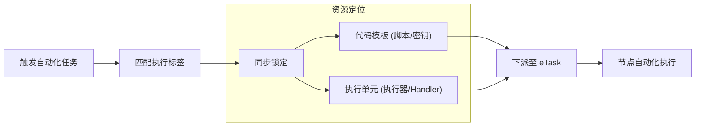

# 任务模版

任务模版是自动化逻辑的核心定义单元。在这里，编写脚本代码，并为其配置具体的执行路径与运行参数。


## 1. 脚本生命周期管理

任务模版的创建采用向导式流程，分为“基本信息”与“代码编写”两个阶段：

- **基本信息**：
  - **名称**：模版的业务名称。
  - **唯一标识**：全局唯一的 uid，是自动化任务分派的逻辑主键。
  - **管理员**：负责维护该脚本的人员。
  - **脚本语言**：支持 `Shell`、`Python` 等常用运行时环境。
- **代码编写**：
  - 集成 Web 端的代码编辑器，支持实时逻辑编写与预览。
  - 自动生成密钥：用于物理节点在拉取任务时的身份校验。

## 2. 脚本入口规范与变量引用

为了提高脚本的复用性，eTask 平台在调用脚本时，固定通过**位置参数**注入核心数据。

### 入口约定
无论使用何种语言，执行器在启动脚本时均遵循以下参数约定：
- **位置参数 1 ($1)**：接收工单提交的信息或上游节点传递的数据（通常为 JSON 字符串）。
- **位置参数 2 ($2)**：接收由 **执行单元 (Runner)** 模块配置生成的环境变量临时文件物理路径。

### 标准脚本模板

#### Shell 引用示例
```bash
#!/bin/bash

# 1. 接收工单/任务参数
args=$1

# 2. 导入由运行器配置的环境变量
# 平台通过 $2 传递临时变量文件路径，通过 source 导入即可实现脚本逻辑与配置隔离
vars=$2
source $vars

# 脚本主体
main() {
    echo "接收到的参数: $args"
    # 直接引用运行器配置中定义的变量，例如 $DB_HOST
    echo "数据库地址: $DB_HOST"
}

main $@
```

#### Python 引用示例
```python
import sys
import os

# 1. 接收参数
args = sys.argv[1]

# 2. 引用变量
# 对于 Python，可以通过读取 $2 指向的文件或直接从环境变量中获取（如果执行器已预注入）
vars_path = sys.argv[2]

def main():
    print(f"接收到的参数: {args}")
    # 业务逻辑...

if __name__ == "__main__":
    main()
```

---

## 3. 执行单元配置

在模版管理列表中，点击“执行单元”即可进入该模版的运行授权管理页面。**配置执行单元本质上是决定该脚本“在哪里跑”以及“怎么跑”。**


### 多单元绑定
**单个任务模版支持绑定多个物理执行单元。** 运维人员可以通过为不同节点配置不同的 **分发模式**、**执行器服务** 以及 **调度标签**，实现灵活的算力调度。

### 授权管理
- **当前绑定**：展示该模版已关联的所有执行单元。
  - 支持对现有绑定进行 **修改**、**删除** 或 **刷新**。
  - 提供 **消息推送** 与 **分布式调度** 两种运行模式的筛选。
- **复用其他单元**：支持跨模版的基础设施配置复用。
  - 可一键将其他模版已测试通过的执行器、Topic、Handler 及标签配置 **复用** 到当前模版下。
  - 复用过程会自动关联当前模版的 `uid` 与 `密钥`，极大提升了多环境下的配置效率。

### 配置明细

- **运行模式**：
  **系统的所有自动化执行能力均深度集成了 eTask 服务。** 管理员可根据业务场景选择两种分发模式：
  - **分布式调度**：通过 eTask 调度中心进行精准分发，支持实时状态监听与任务生命周期维护。
  - **消息队列**：同样基于 eTask 构建，但采用消息队列进行异步下派，适用于与外部系统联动的场景。
- **执行器与处理器**：
  - **执行器**：指定该任务的执行目标。在分布式模式下体现为 **执行器服务**，在消息队列模式下体现为对应的 **Topic**。两者在逻辑上均视为执行任务的终端入口。
  - **执行处理器**：指定执行器内部的具体处理逻辑，决定脚本的运行时环境（如 `shell`, `python` 等）。
- **调度标签**：用于工作流运行时动态匹配最合适的物理执行环境。系统会根据该模版下绑定的执行单元，结合工作流中配置的标签进行精准匹配。
- **变量环境**：支持为每个绑定的执行单元配置独立的环境变量。


---

## 4. 记录脚本执行结果

当任务模版在工作流中运行时，脚本产出的关键数据（如状态码、查询到的资源 ID、业务指标等）可以被回传并记录在系统中，供后续工作流节点进行逻辑判断或变量引用。

系统底层约定通过 **文件描述符 3 (FD3)** 接收并记录脚本产出的 JSON 格式结果。

### 结果记录机制
平台提供了辅助工具，帮助运维人员在脚本中轻松记录执行结果。

#### Shell 使用示例
```bash
# 引用工具函数
source ./third_party/utils/want_result.sh

# 推荐用法：逐行记录执行结果
# 语法：want_result "key" "value"
want_result "status" "success"
want_result "version" "1.0.2"
want_result "output" "done"

# 备选用法：分步构建复杂的 JSON（适用于循环逻辑）
add_to_json "disk_usage" "75%"
add_to_json "node_status" "ready"
finalize_json
```

#### Python 使用示例
平台同样提供了 Python 版本的封装库 `./third_party/base/want_result.py`：

```python
# 引用封装好的工具
from third_party.base.want_result import want_result, JsonBuilder

# 推荐用法：按需记录结果
# 语法：want_result(key=value)
want_result(status="success")
want_result(version="1.0.2")

# 备选用法：使用 JsonBuilder 逐步构建
builder = JsonBuilder()
builder.add_to_json("disk_usage", "75%")
builder.finalize_json()
```
---

---

## 5. 任务分发逻辑

自动化任务的分发以“标签”为核心枢纽，通过解耦实现灵活的调度：


