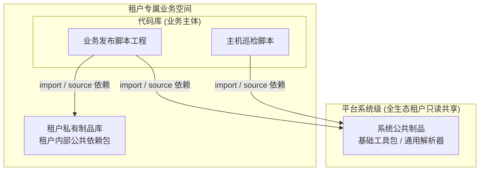
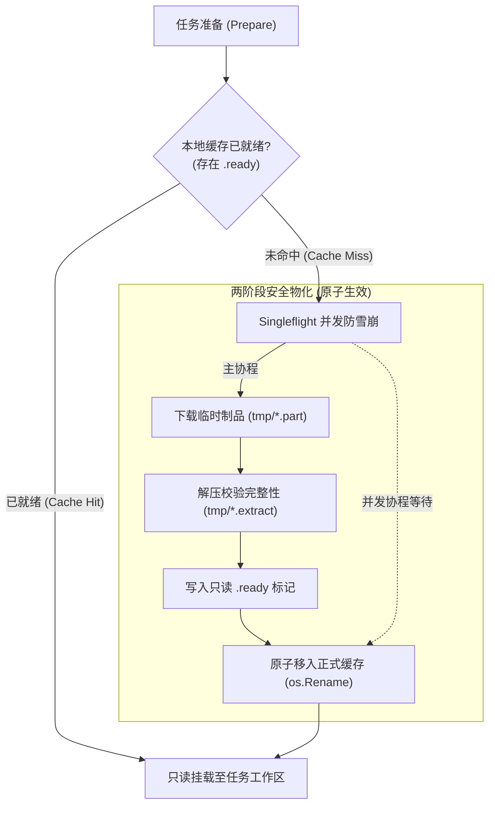

# 任务模版与代码制品

ETask 将传统的“单机离散脚本”升级为标准化、工业级的**代码资产与制品调度体系**。通过将「直接执行的业务代码」与「按需引用的依赖制品」彻底解耦，系统构建了系统级全租户共享、两阶段原子物化、安全沙箱隔离与多环境智能路由的完整闭环。

---

## 1. 核心资产模型：代码库 vs 制品库

在 ETask 体系中，脚本资产清晰划分为**业务执行主体**与**公共依赖模块**两大核心角色：

| 资产分类 | 核心角色定位 | 典型使用方式 | 作用域与隔离边界 |
| :--- | :--- | :--- | :--- |
| **代码库** | **你直接执行的业务代码**<br/>主程序入口与核心业务逻辑 | 任务模版直接指定其为主入口执行，承载具体的业务操作（如应用发布、日常巡检、配置变更） | **租户私有**：按项目组织，各租户完全物理隔离，自主在线编辑与迭代 |
| **制品库** | **你按需依赖的公共模块**<br/>被引用的通用模块与依赖包 | 不作为主入口直接运行，而是被代码库通过 `import` 或 `source` 引入复用 | 分为系统级（全平台租户共享）与租户级（租户内部共享） |

### 资产协同与共享拓扑


```mermaid
flowchart TD
    subgraph SysLayer ["平台系统级 (全生态租户只读共享)"]
        SysArt["系统公共制品<br/>基础工具包 / 通用解析器"]
    end

    subgraph TenantSpace ["租户专属业务空间"]
        direction TB
        TenantArt["租户私有制品库<br/>租户内部公共依赖包"]
        
        subgraph Codebooks ["代码库 (业务主体)"]
            DeployJob["业务发布脚本工程"]
            CheckJob["主机巡检脚本"]
        end
    end

    DeployJob -->|"import / source 依赖"| SysArt
    DeployJob -->|"import / source 依赖"| TenantArt
    CheckJob -->|"import / source 依赖"| SysArt
```

* **系统级制品**：平台统一预置并发布通用工具库（如 Python 常用包、Shell 结构化结果解析器），全平台所有租户开箱即用，避免各租户重复打包造轮子；
* **租户级制品**：租户团队将内部沉淀的公共模块打包发布，供该租户下多个不同的代码库和任务复用；
* **代码库**：承载具体业务逻辑，调度运行时挂载为主工作区（`ETASK_PROJECT_ROOT`），并按需并联引入所依赖的制品。

---

## 2. 模版形态与资产作用域

### 2.1 任务模版的代码形态

任务模版是运维逻辑的业务载体，根据任务复杂度支持两种代码交付形态：

| 对比维度 | 内联代码 | 代码工程 |
| :--- | :--- | :--- |
| **适用场景** | 几十行以内的排障脚本、健康探针、单文件临时命令 | 复杂多文件工程、携带私有依赖包、Ansible Playbook 工程包 |
| **存储载体** | 关系型数据库（MySQL）字段存储 | 对象存储（MinIO / S3）不可变压缩归档 |
| **版本管理** | 控制台在线即时编辑与保存 | 基于 SHA-256 内容哈希严格版本化 |
| **物化开销** | 零解压开销，节点直接写为临时执行脚本 | 节点本地缓存、并发归并与两阶段原子解压 |

### 2.2 系统级 vs 租户级治理矩阵

| 维度 | 系统级资产 | 租户级资产 |
| :--- | :--- | :--- |
| **资产定位** | 平台预置的通用组件库、标准工具包与基础依赖 | 租户业务团队自研的私有脚本工程、业务部署包与定制逻辑 |
| **项目归属** | 全局公共托管（不绑定特定业务项目） | 归属各租户专属的项目进行生命周期管理 |
| **读取与复用范围** | **全生态只读共享**：全平台任意租户均可按需引用依赖 | **租户边界私有**：仅所属租户可查、可用、可执行 |
| **制品命名空间** | 平台全局规范，无需声明租户命名空间 | 必须声明专属 `artifact_namespace`（系统保留名 `etask` 禁止占用） |
| **交付与发布方式** | **镜像内置 + CLI 导入发布**：基础工具已随镜像打包，执行命令即可一键发布为系统制品；支持热更新 | **Web 控制台发布**：代码树在线快照或 Webhook 触发打包发布制品 |

::: tip 多层并联挂载机制
一个作业可同时引用 **SYSTEM 系统依赖层** 与 **TENANT 租户源码层**。执行节点基于 `errgroup` 并发拉取两层制品并独立缓存，最终以只读方式并联注入任务隔离工作区，既实现了平台标准能力的秒级复用，又杜绝了跨租户交叉污染。
:::

### 2.3 系统组件库导入与发布规范

ETask 系统级公共制品采用 **镜像静态内置 + CLI 运维一键发布** 的标准化交付模式：

#### 1. 基础公共工具库镜像内置
在 ETask 官方部署镜像中（参见 `deploy/Dockerfile`），平台核心基础库与辅助脚本已随镜像打包至容器工作目录中（`/app/third_party`）：
* **内置核心资产**：
  * `third_party/utils/want_result.sh`：Shell 结构化结果（FD 3）回传工具；
  * `third_party/base/want_result.py`：Python 结果回传与通信 SDK；
  * 基础 Python 运行时环境与依赖模块。

#### 2. 初始化导入发布命令
服务部署就绪后，平台管理员只需在容器内（或运维执行机）执行一次 `codebook import-system` 命令，即可将内置目录打包、上传对象存储并发布为不可变系统级制品（SYSTEM）：

```bash
# 导入容器内置的 third_party 工具包并发布为系统公共制品
./etask codebook import-system \
  --dir ./third_party \
  --root-name third_party \
  --replace
```

* `--dir`：需要导入的代码目录（容器内部默认直接指定 `./third_party`）；
* `--root-name`：导入后在系统的根目录名称（建议保持 `third_party`，以保证 `$ETASK_SYSTEM_ROOT/third_party` 路径契约一致）；
* `--replace`：可选。若已存在同名系统组件库，先原子清理旧版本再发布新版本。

发布完成后，元数据写入数据库、制品包持久化至对象存储（S3 / MinIO）。全平台任意租户的执行节点拉取任务时，均会自动只读挂载该系统制品层，业务脚本即可开箱调用。

#### 3. 运维热更新与扩展外部库
若后续需要对系统内置工具打补丁，或引入额外的第三方运维工具包（如 `common-toolkit`），管理员只需准备好脚本目录并重新执行 `import-system` 即可实现**零停机热发布**，无需重新构建或重启调度中心服务。

---

## 3. 脚本开发契约与执行范式

为了保证各类语言脚本在不同分发通道（gRPC / Kafka）下的安全性与一致性，ETask 规范了**输入参数契约**与**跨层依赖调用标准**。

### 3.1 标准输入与环境契约

淘汰传统的命令行位置参数（杜绝 `ps` 进程敏感信息泄露），统一采用文件注入：

* **`ETASK_ARGS_FILE`**：**业务入参文件**。只读 JSON 文件（权限 `0600`），接收上游触发源（API、定时调度、工单表单）传递的入参（无入参时内容为 `{}`）；
* **`ETASK_VARIABLES_FILE`**：**环境变量文件**。只读 JSON 文件（权限 `0600`），注入 Runner 变量配置，实现敏感凭证与代码的解耦；
* **`ETASK_WORKSPACE_ROOT`**：本次作业的独立工作区根路径；
* **`ETASK_PROJECT_ROOT`**：主工程源码的只读挂载路径。

### 3.2 跨层制品依赖调用规范

执行端在拉起任务进程前，会自动将挂载的 SYSTEM 制品与租户制品注入至进程环境变量与模块搜索路径中：

| 引用调用方向 | 支持状态 | 跨语言调用约定 |
| :--- | :--- | :--- |
| **业务脚本 -> 系统公共库** | ✅ 深度支持 | Python 通过 `from etask...`；Shell 通过 `$ETASK_SYSTEM_ROOT` 引用 |
| **业务脚本 -> 租户公共库** | ✅ 深度支持 | Python 通过 `from <namespace>...`；Shell 通过 `$ETASK_DEPENDENCIES_ROOT` 引用 |
| **租户公共库 -> 系统公共库** | ✅ 深度支持 | 租户公共库亦可复用平台底层工具模块 |
| **系统公共库 -> 租户公共库** | ❌ 严禁反向依赖 | SYSTEM 属于平台全局公共基座，严禁反向耦合特定租户环境 |

### 3.3 标准代码编写模板

::: code-group

```bash [Shell 标准工程范式]
#!/bin/bash
set -euo pipefail

# 1. 跨层依赖引用：加载系统工具库与租户公共模块
if [ -n "${ETASK_SYSTEM_ROOT:-}" ]; then
  source "$ETASK_SYSTEM_ROOT/third_party/utils/want_result.sh"
fi
if [ -n "${ETASK_DEPENDENCIES_ROOT:-}" ]; then
  source "$ETASK_DEPENDENCIES_ROOT/ops_common/scripts/common.sh"
fi

# 2. 业务参数解析：从 ETASK_ARGS_FILE 读取 JSON 载荷
args=$(<"$ETASK_ARGS_FILE")
echo "接收到任务入参: $args"

# 3. 环境变量读取：Runner 变量已直接注入子进程环境
echo "目标主机: ${TARGET_HOST:-"127.0.0.1"}"
echo "工作区路径: ${ETASK_WORKSPACE_ROOT}"
```

```python [Python 标准工程范式]
#!/usr/bin/env python3
import json
import os

# 1. 跨层依赖引用：直接从 etask 系统命名空间与租户命名空间 import
try:
    from etask.private import util
    from etask.third_party.base.want_result import want_result
except ImportError:
    pass

try:
    from ops_common.scripts import helper
except ImportError:
    pass

def main():
    # 2. 读取任务业务入参 (从 ETASK_ARGS_FILE 读取)
    with open(os.environ["ETASK_ARGS_FILE"], encoding="utf-8") as f:
        args = json.load(f)
    print("业务入参:", args)

    # 3. 解析 Runner 结构化环境变量 (从 ETASK_VARIABLES_FILE 读取)
    with open(os.environ["ETASK_VARIABLES_FILE"], encoding="utf-8") as f:
        variables = {item["key"]: item["value"] for item in json.load(f)}
    print("数据库配置:", variables.get("DB_HOST", "localhost"))

    # 4. 获取独立工作区路径
    print("工作目录:", os.environ.get("ETASK_WORKSPACE_ROOT"))

if __name__ == "__main__":
    main()
```

:::

---

## 4. 节点物化与并发防雪崩

针对工程化代码包的分发，ETask 设计了**不可变分发与两阶段原子物化**机制，确保高并发调度下的绝对安全与高效：


```mermaid
flowchart TD
    Task["任务准备 (Prepare)"] --> Check{"本地缓存已就绪?<br/>(存在 .ready)"}

    %% 快路径：命中直接挂载
    Check -->|"已就绪 (Cache Hit)"| Mount["只读挂载至任务工作区"]

    %% 慢路径：未命中进入并发安全物化
    Check -->|"未命中 (Cache Miss)"| SF["Singleflight 并发防雪崩"]

    subgraph Mat ["两阶段安全物化 (原子生效)"]
        direction TB
        SF -->|"主协程"| Download["下载临时制品 (tmp/*.part)"]
        Download --> Extract["解压校验完整性 (tmp/*.extract)"]
        Extract --> Ready["写入只读 .ready 标记"]
        Ready --> Commit["原子移入正式缓存 (os.Rename)"]
    end

    SF -.->|"并发协程等待"| Commit
    Commit --> Mount
```

### 核心物化技术矩阵

| 核心技术 | 解决痛点 | 源码级实现机制 |
| :--- | :--- | :--- |
| **内容哈希寻址** | 脚本重名冲突、冗余存储与版本歧义 | 基于制品 SHA-256 校验和生成全局唯一 `cacheKey`，以 `layers/<key>` 目录收敛，实现跨任务秒级缓存命中。 |
| **并发防雪崩归并** | 海量任务高并发下打满网络带宽与磁盘 I/O | 基于 `singleflight.Group` 按键归并，同时通过 `context.WithoutCancel` 脱钩调用方超时，保证后台稳定完成物化并供后续任务复用。 |
| **两阶段原子物化** | 并发读取到解压未完成的“半成品”导致脏读 | 全程在 `tmp/` 临时目录执行下载与解压校验，写入只读 `.ready` 凭据后通过 `os.Rename` 原子切换为正式目录，未就绪前禁止读取。 |
| **分层并行与只读隔离** | 多依赖层串行耗时长、任务执行污染公共环境 | 基于 `errgroup` 并行物化源码层与具名依赖层；执行端将目录以只读权限注入运行上下文，杜绝跨任务篡改与污染。 |

---

## 5. 模版核心定义：引用、变量与执行单元

任务模版是自动化作业的标准化业务定义单元，通过松耦合方式将三大核心要素组装为完整的任务配置，实现“逻辑与算力解耦、代码与配置分离”：

| 模版装配要素 | 核心职责 | 具体配置内容 |
| :--- | :--- | :--- |
| **1. 代码与制品引用** | 定义“执行什么脚本” | 声明主执行代码（内联脚本或代码库工程），并按需并联挂载所依赖的系统公共制品或租户私有制品 |
| **2. 环境变量与参数** | 定义“运行输入与凭据” | 声明任务专属的运行时变量、敏感凭证映射，以及上游触发所需的业务入参规则 (`ETASK_ARGS_FILE`) |
| **3. 关联执行单元** | 定义“交由谁调度执行” | 绑定目标执行单元。任务模版本身不硬编码物理主机或 IP，而是将调度路由委托给执行单元负责 |

> [!TIP] 逻辑与算力解耦
> 任务模版专注于**业务代码、输入参数与依赖引用**；而具体的执行节点发现、网络分发通道（gRPC 高速直推 / Kafka 边缘出站）与标签智能路由策略，则在后续章节专门展开，详情请参阅 [执行单元与调度路由](/task/execution)。


