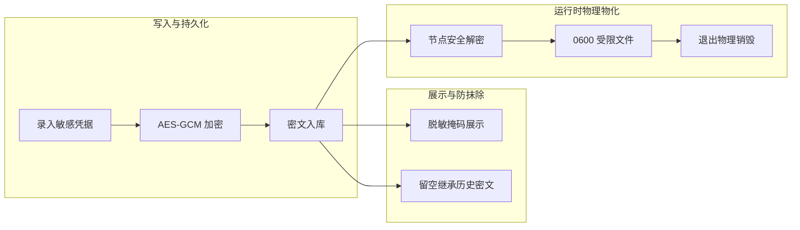

# 环境变量与敏感凭据

在自动化运维与作业调度中，脚本不仅需要跨环境动态适配主机地址、端口、数据库账号与访问令牌，还需感知作业工作区、制品路径与参数文件。ETask 将运行环境拆解为**系统内置环境变量**与**用户自定义分层变量**两大体系，实现脚本与运行环境深度解耦，确保凭据全生命周期零明文泄漏。

---

## 1. 系统内置环境变量矩阵

每次作业调度启动时，执行节点会为当前任务创建独占的隔离沙箱工作区，并根据目标处理器的语言类型，注入标准化的环境变量与受控文件：

### 1.1 全语言通用运行时环境

无论执行何种语言脚本，系统均会自动注入以下基础沙箱与路径环境：

| 环境变量 | 注入条件 | 核心语义与用途 |
| :--- | :--- | :--- |
| **`ETASK_WORKSPACE_ROOT`** | 始终提供 | 本次执行的独立临时沙箱根目录（任务执行完毕后物理销毁）。 |
| **`ETASK_PROJECT_ROOT`** | 项目工程代码 | 当前项目的只读挂载根目录，也是脚本执行的默认工作目录。 |
| **`ETASK_SYSTEM_ROOT`** | 包含系统级制品 | 系统公共基础制品的只读挂载根目录。 |
| **`ETASK_DEPENDENCIES_ROOT`** | 包含租户级制品 | 当前租户具名依赖制品库的聚合挂载根目录。 |
| **`EWORK_RESULT_FD`** | 始终提供 | 结构化结果回传的文件描述符（固定为 `3`）。系统内置提供了 `want_result` 工具库（详见 [Shell](/task/runner/shell) 与 [Python](/task/runner/python)）封装此通道。 |
| **`FORCE_COLOR`** | 始终提供 | 固定为 `1`，指示子进程命令保留终端色彩输出。 |
| **`TERM`** | 始终提供 | 固定为 `xterm-256color`，提供标准的终端模拟环境。 |

### 1.2 Shell 执行器专属契约

Shell 脚本执行时，变量与入参采用安全文件传输，同时变量自动打入子进程环境：

| 环境变量 | 权限模式 | 核心语义与用途 |
| :--- | :--- | :--- |
| **`ETASK_ARGS_FILE`** | `0600` 受控文件 | 任务业务入参的 JSON 文件绝对路径；无入参时文件内容为 `{}`。 |
| **`ETASK_VARIABLES_FILE`** | `0600` 受控文件 | 经合并后的有效环境变量 JSON 文件路径；无变量时内容为 `[]`。 |
| **`ETASK_SHELL_ENV_FILE`** | `0600` 受控文件 | 格式化的环境变量键值对文件，支持在脚本中通过 `source` 安全导入。 |

> **提示**：Shell 执行器已将全部有效变量直接注入子进程，脚本中推荐直接通过 `$VAR_NAME` 读取，无需显式 `source`。

### 1.3 Python 执行器专属契约

Python 执行器通过文件管道规避命令注入，并自动打通跨层制品模块导入：

| 环境变量 | 权限 / 赋值 | 核心语义与用途 |
| :--- | :--- | :--- |
| **`ETASK_ARGS_FILE`** | `0600` 受控文件 | 业务入参 JSON 文件绝对路径，供脚本通过 `json.load` 解析。 |
| **`ETASK_VARIABLES_FILE`** | `0600` 受控文件 | 环境变量 JSON 文件绝对路径，包含键值对与敏感标记。 |
| **`PYTHONPATH`** | 路径列表追加 | 自动将系统公共层与租户制品层追加至 Python 模块搜索路径首位，实现无感导入。 |
| **`PYTHONUNBUFFERED`** | 固定为 `1` | 禁用标准输出缓冲区，确保脚本打印日志微秒级实时回显至控制台。 |

### 1.4 Ansible 执行器专属契约

Ansible 自动化作业通常需操作大量临时状态，执行端通过重定向工作目录实现多租户严格隔离：

| 环境变量 | 注入路径 | 核心语义与用途 |
| :--- | :--- | :--- |
| **`ANSIBLE_HOME`** | 沙箱工作区内部 | 重定向 Ansible 用户主目录，隔离多任务并发下的主机指纹与缓存。 |
| **`ANSIBLE_LOCAL_TEMP`** | 沙箱工作区内部 | 重定向本地临时执行目录，任务结束随工作区一同物理销毁。 |

> **提示**：Ansible 的私钥/密码认证材料严禁作为普通变量录入，必须通过物理隔离的凭据机制管理，详见 [Ansible 剧本编排](/task/runner/ansible)。

::: warning 系统命名保留与防篡改规则
`ETASK_` 前缀与 `EWORK_RESULT_FD` 属于 ETask 系统运行时保留标识符。用户自定义的变量名称**严禁以 `ETASK_` 开头**，否则在变量校验阶段将被系统直接拦截拒绝，防止破坏底层的沙箱运行环境。
:::

---

## 2. 自定义变量作用域模型

除系统内置变量外，用户可在平台不同层级配置自定义环境变量与凭据。ETask 遵循严谨的三层作用域体系：

| 作用域层级 | 配置载体 / 入口 | 核心定位与典型场景 |
| :--- | :--- | :--- |
| **租户全局变量 (低)** | 租户控制台 -> 全局变量 | 当前租户名下所有任务默认继承的公共基线（如本租户内网镜像源、代理网关、通知地址）。 |
| **执行单元变量 (中)** | 执行单元配置 -> 环境变量 | 绑定特定算力池或网络分区的专属配置（如机房代理、内网数据库直连 IP、Ansible 免密凭据）。 |
| **任务与运行时变量 (高)** | 任务模版配置 / 单次工单审批触发 | 当前任务专属直接指定的私有变量，或在工单流转、API 调度单次作业时动态注入的临时覆盖值。 |

::: tip 全局变量是租户级别还是系统级别？
* **自定义全局变量严格属于【租户级别】**：数据表以 `tenant_id` 作为联合主键首列，并由多租户安全拦截器强制隔离。A 租户配置的全局变量对 B 租户完全不可见，更不会互相影响；
* **为什么不设计跨租户的“系统级自定义变量”？**：为了杜绝跨租户命名污染与越权风险。系统级的跨租户公共能力，统一由**第一节的系统内置环境变量**（如 `ETASK_*`、`PYTHONPATH`）以及**系统公共基础制品库**（`SYSTEM` 作用域）来承载，自定义变量体系保持严格的租户自治。
:::

---

## 3. 优先级合并与防降级防护

当任务调度执行时，系统自动将各层级变量自底向上进行叠加合并。

### 3.1 变量覆盖优先级

同名变量发生冲突时，遵循 **单次临时覆盖 > 任务直接指定 > 执行单元配置 > 租户全局默认** 的基本规则：

1. **自动继承基线**：任务模版未指定时，默认自动继承目标执行单元及租户配置的全部环境变量；
2. **任务直接指定优先**：若任务模版中直接指定了同名变量（如手填了 `ENV=prod`），**直接指定的值会覆盖**执行单元继承的基线值；
3. **单次临时覆盖最高**：工单提单审批或 API 调用时临时传入的变量，拥有最高优先级，覆盖前面所有层级。

### 3.2 敏感状态自动继承（防降级铁律）

在运维自动化中，一个常见的安全隐患是高优先级覆盖导致敏感密钥被降级为普通明文。ETask 在合并变量时内置了**强制防降级安全校验**：

* **核心规则**：只要低优先级层级（如执行单元）中某个变量被标记为敏感凭据（`secret: true`），无论高优先级覆盖时是否声明敏感，**系统强制保留敏感属性**；
* **防护效果**：即使工单提单或临时调用时误传入了未加密的明文，系统仍强制将其作为密文加密落盘，并在控制台日志回传中自动打码为 `******`，彻底根除隐性降级泄露风险。

### 3.3 变量合并与防降级示例

```text
输入层级                              传入变量键值                          最终生效值与状态
──────────────────────────────────────────────────────────────────────────────────────────
租户全局 (底层基线)           ───►   ENV = "dev"
执行单元 (机房基线)           ───►   DB_USER = "guest"
任务模版直接指定 (任务私有)   ───►   ENV = "prod" (直接指定覆盖基线)        ───►   ENV = "prod"
任务模版直接指定 (任务私有)   ───►   API_KEY = "token_a" (声明敏感: true)
单次触发覆盖 (顶层优先)       ───►   DB_USER = "admin" (同名覆盖)           ───►   DB_USER = "admin"
单次触发覆盖 (顶层优先)       ───►   API_KEY = "token_b" (未声明敏感)       ───►   API_KEY = "token_b" (强制继承敏感加密!)
```

## 4. 敏感凭据全生命周期安全

针对数据库密码、API Token、私钥证书等高敏配置，ETask 构建了从落盘、展示到物化的全生命周期闭环防护：



### 核心安全机制

* **落盘强制加密**：敏感变量在持久化前，统一经过 AES-GCM-256 加密落盘（前缀标记为 `ENC:V1:`），数据库介质中绝不留存任何明文；
* **展示脱敏掩码**：控制台列表与 API 查询统一经脱敏管道替换为 `******` 掩码，杜绝界面与网络传输层泄露；
* **编辑增量防抹除**：在 Web 页面修改其他配置时，敏感凭据输入框直接留空即可自动沿用历史密文，无需重复录入私密内容；
* **规避进程嗅探（关键安全优势）**：
  在 Linux 运维环境中，传统命令行位置传参（如 `-p password`）极易被同机普通用户通过 `ps -ef` 或 `/proc/$PID/cmdline` 窥探。ETask 统一将凭据以 `0600` 权限写入独占沙箱中的临时受控文件，并通过子进程内部环境变量直接加载，彻底根除进程嗅探风险。

---

## 5. 各运行时接入与消费指引

各类语言在独占沙箱中读取环境变量、解析入参文件以及回传指标的完整模板与最佳实践，请直接参阅对应的执行引擎文档：

| 执行引擎 | 核心变量消费与运行时机制 | 详细参考 |
| :--- | :--- | :--- |
| **Shell** | 环境变量自动注入子进程、`0600` 入参文件提取、`want_result.sh` 结果回传 | [Shell 脚本执行](/task/runner/shell) |
| **Python** | 自动追加 `PYTHONPATH`、`0600` 入参 JSON 反序列化、`want_result` SDK 调用 | [Python 脚本执行](/task/runner/python) |
| **Ansible** | 宿主凭据安全库隔离、`etask_credential_ref` 别名装配、Playbook 滚动编排 | [Ansible 剧本编排](/task/runner/ansible) |
| **自定义 SDK** | `executor.Context` 读取参数、上报流式日志与进度、写入结构化结果 | [自定义执行器开发](/task/runner/custom) |

