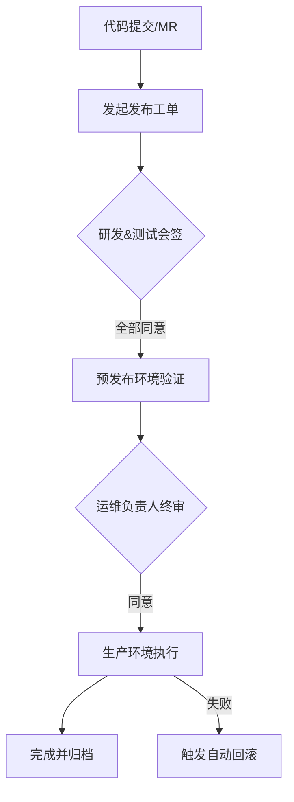

# 🚀 应用发布 (CI/CD)

通过工单系统，您可以将繁琐的代码上线过程转化为标准化的审批与自动化流水线，确保发布过程的合规性与稳定性。

## 🎯 业务痛点
- **协作难**：研发、测试、运维多方沟通成本高，发布指令不统一。
- **合规差**：缺乏审批流程，误操作风险高。
- **效率低**：手动执行流水线，容易漏掉特定环境。

## 🛠️ 流程编排建议

### 关键节点配置
1. **开始节点**：关联发布表单（版本号、发布分支、变更范围）。
2. **会签节点 (User Node)**：配置为「研发负责人」与「测试负责人」必须全部通过。
3. **自动化节点 (Task Node)**：调用内部 Jenkins 或 Gitlab CI 接口，传入当前工单的 `version` 变量。
4. **决策节点 (Condition)**：根据自动化节点的执行结果自动重定向到「回滚」或「完结」。

> [!TIP]
> 建议在发布窗口期配合「定时触发」功能，实现更精准的生产变更。
