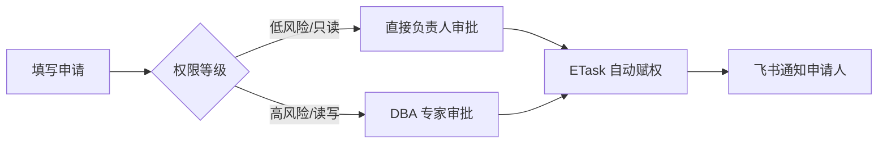

# 🔐 权限申请 (ACL)

标准化资产访问权限的申请与下发，实现权限的「按需申请、限时生效、自动回收」。

## 🎯 业务痛点
- **申请慢**：依赖线下找人或即时通讯工具申请，记录易丢失。
- **赋权乱**：权限只给不收，长期积累导致巨大的安全隐患。
- **审计难**：谁申请的、谁审批的、什么时候给的，无法快速闭环。

## 🛠️ 流程编排建议

### 场景：MySQL 数据库读写权限申请

### 关键控制点
- **数据映射 (Merge Data)**：申请人填写的 `DB_NAME` 在审批通过后，自动作为变量传递给 ETask。
- **外部集成**：赋权成功后，通过飞书机器人发送「环境地址」与「临时密码」的私密卡片。
- **自动审计**：流程结束自动生成全量审计报告，作为合规检查的基础。

> [!IMPORTANT]
> 配合「变量池」功能，可以实现赋权的同时记录解封时间，配合定时任务实现权限到期自动回收。
