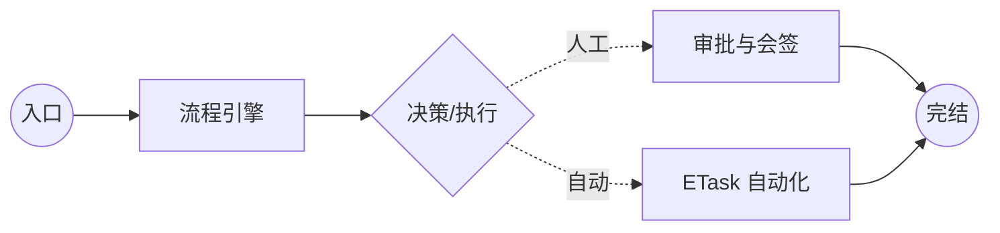

# 设计思想

ECMDB 的工单系统是平台中负责 **「运维流程治理」** 的核心。它将非标的运维操作转化为 **结构化、可审计、自动化** 的标准流水线。

## 1. 核心模型

系统通过两个核心维度来实现业务逻辑的解耦：

- **[模版](/workflow/management/template)**：定义了前端表单结构以及在门户页的展示形式。
- **[流程](/workflow/management/workflow)**：定义了工单在后台的流转路径、审批逻辑以及自动化任务。

## 2. 作业流演示

工单系统通过定义明确的「节点」与「连线」，实现从业务申请到自动化执行的极简闭环：

## 3. 核心价值

### 1. 全栈快照机制
运维变更最重一致性。系统在工单发起时，会同时锁定 **「流程定义」** 与 **「数据版本」**。
- 即使管理员后续修改了模板，正在运行的工单依然按照原有的逻辑安全运行。
- 每一个节点的审批意见和字段录入都被记录为独立快照，实现金融级的变更溯源。

### 2. 数据随流程演进
工单不仅是流传，更是数据的收集过程。支持 **「字段合并 (Merge)」** 机制：
- 流程运行过程中产生的新数据（如：脚本返回的 ID、审批人补充的信息）可以实时合并到工单主数据中。
- 所有后续节点都能通过 `variable` 语法零门槛调用先前的处理结果。

### 3. 飞书深度协同
打破系统孤岛，实现真正的「人在哪，审批就在哪」。
- 深度集成 **飞书审批** 回调，支持在飞书客户端直接查看运维工单并进行决策。
- 实时通过机器人推送执行进度卡片，让运维动态尽在掌握。

### 4. 分布式任务执行
让流程不再只有「通知」，更有「产出」。
- 通过异步消息队列（Kafka）将指令下发至 **ETask** 分布式执行器。
- 支持实时抓取远程脚本执行日志，并将其持久化作为审计证据。

> [!IMPORTANT]
> **总结：** ECMDB 工单系统通过「审批流」与「执行流」的深度解耦，在保障运维合规性的同时，极大地提升了自动化执行的效率。
