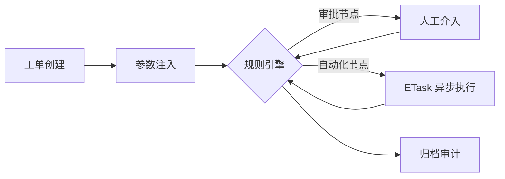

# 📖 工单系统概念总览

ECMDB 的工单系统是平台中负责 **「业务标准化执行」** 的枢纽。它通过将复杂的运维操作拆解为可定义的流程，确保每次操作都有迹可循、合规且自动化。

## 🌟 设计哲学

### 1. 结构化数据映射 (Structured Mapping)
工单不仅是文本记录，更是结构化数据的载体。
- **变量流转**：通过 `{{variable}}` 语法，数据在不同节点间无缝传递。
- **字段合并 (Merge)**：支持在审批过程中更新工单的主数据，确保最终结果的完整性。

### 2. 过程快照化 (Snapshot Pursuit)
为了应对流程定义变更带来的影响，系统采用了严格的快照机制。
- **定义快照**：工单发起时锁定当前流程图版本，后续修改不影响运行中的工单。
- **任务快照**：每一个节点的审批意见和填写的表单字段都会被单独存储，实现精细化的审计。

### 3. 多源集成 (Multi-Source Integration)
系统设计之初就考虑了外部系统的接入能力。
- **企业微信联动**：支持接收并解析来自企业微信的 OA 审批事件。
- **告警触发**：支持将监控系统（如 EAlert）抛出的异常自动转换为排障工单。

---

## 🔄 流程生命周期

1.  **创建阶段**：支持从 Web 端、企业微信回调或告警事件触发创建，初始化环境变量。
2.  **流转阶段**：流程引擎根据定义的节点路径进行跳转。
    *   **字段校验**：支持对节点填写的字段进行必填检查与正则校验。
    *   **会签/或签**：灵活的审批策略配置。
3.  **执行阶段**：对于自动化节点，系统将任务下发给 **ETask**，并实时记录执行日志。
4.  **归档阶段**：归档所有历史任务快照，提供完整的操作溯源。

---

## 📍 核心术语

| 术语 | 说明 |
| :--- | :--- |
| **流程定义 (Workflow)** | 流程的逻辑模板，定义了节点关系、字段规则和操作权限。 |
| **工单实例 (Order)** | 流程运行的实体，承载了具体的业务数据（Data）和状态。 |
| **任务节点 (Task)** | 流程运行中的具体环节，每个任务都有对应的处理人和表单快照。 |
| **外部供应 (Provide)** | 工单的来源，如 `SYSTEM`、`WECHAT` 或 `ALERT`。 |

> [!TIP]
> 流程引擎支持针对不同节点配置「可编辑字段」，并能实现数据的自动合并（Merge）。
